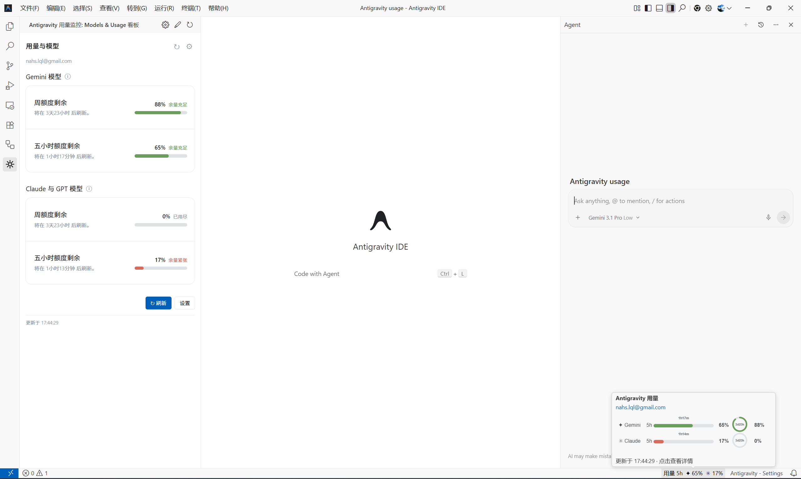
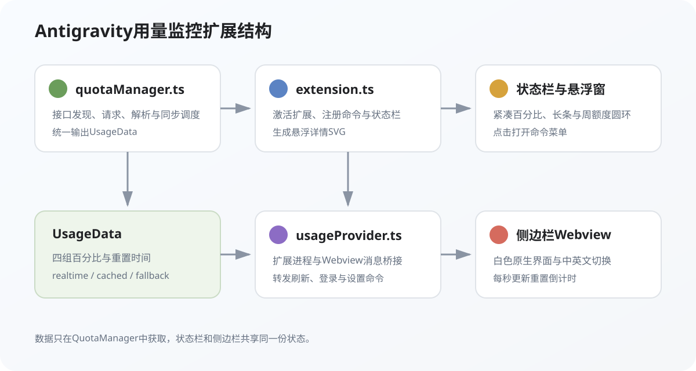
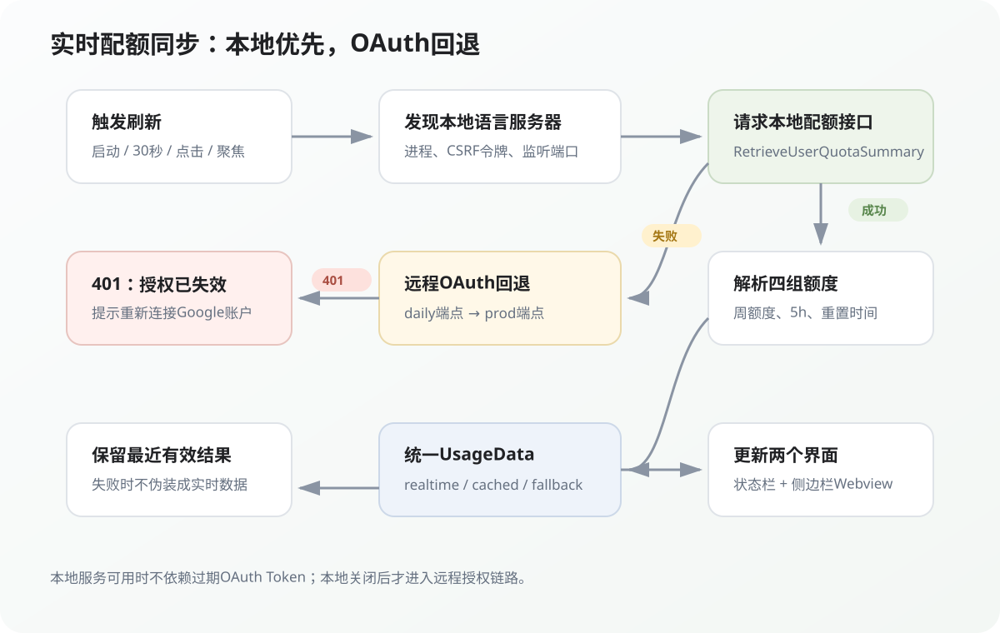

# 给Antigravity做一个实时用量监控插件：从本地缓存到官方配额接口

> 源码：[github.com/NaHSIT/Antigravity-Usage](https://github.com/NaHSIT/Antigravity-Usage)

8月5日，我想解决一个很具体的小问题：Antigravity的Gemini、Claude和GPT额度藏在Models & Usage页面里，每次想看还得离开编辑区、打开设置，再判断周额度和五小时额度还剩多少。写代码正写到一半时，这个操作很打断节奏。

于是我给Antigravity做了一个VS Code扩展，把用量放进编辑器底部状态栏，鼠标悬停就能看完整配额，侧边栏再提供更详细的看板。真正花时间的却不是画几个进度条，而是让“实时”两个字名副其实：我先读本地缓存，以为加上定时轮询就够了；后来发现缓存根本没有持续更新；改成远程OAuth接口后，又撞上了HTTP 401；最后才把数据源切到Antigravity正在运行的本地语言服务器。

这篇文章就把这条从“能显示”到“数据真的在更新”的开发过程完整记下来。

---

## 1. 最终做出来的东西

插件有两个主要入口。

底部状态栏只保留最需要扫一眼的信息：当前展示的是五小时还是周额度，以及Gemini和Claude/GPT两组模型的剩余百分比。鼠标悬停后，弹层会同时显示五小时长条、周额度圆环、各自的重置倒计时和账号信息。

侧边栏则更适合认真查看：两组模型各有周额度和五小时额度，进度颜色会随余量变化，并且支持中文、英文切换、手动刷新和Google账户连接。



我最后保留了四档颜色：

| 剩余额度 | 颜色 | 状态 |
|------|------|------|
| 51%-100% | 绿色 | 余量充足 |
| 21%-50% | 黄色 | 余量适中 |
| 1%-20% | 红色 | 余量紧张 |
| 0% | 灰色 | 已用尽 |

状态栏本身没有跟着低额度变成一整块红色。早期版本这样做过，结果Claude只剩17%时，底部那块红色比代码报错还抢眼。额度需要提醒，但不能一直对着人喊，所以颜色只留在进度图形里。

---

## 2. 扩展结构：数据层和界面层分开

项目使用TypeScript开发，没有引入前端框架。源码主要拆成五个文件：

- `extension.ts`负责扩展激活、状态栏、命令和悬浮详情；
- `quotaManager.ts`负责发现数据源、请求接口、解析配额和同步调度；
- `usageProvider.ts`负责Webview与扩展进程之间的消息桥接；
- `getWebviewContent.ts`生成侧边栏的HTML、CSS和JavaScript；
- `types.ts`定义统一的`UsageData`数据结构。



我没有让侧边栏自己发网络请求。所有数据先进入`QuotaManager`，再通过事件同时更新状态栏和Webview。这样无论数据来自本地语言服务器、远程OAuth接口还是备用配置，UI只认同一份`UsageData`：

```ts
export interface UsageData {
  geminiWeekly: number;
  geminiWeeklyResetIso?: string;
  geminiFiveHour: number;
  geminiFiveHourResetIso?: string;
  claudeWeekly: number;
  claudeWeeklyResetIso?: string;
  claudeFiveHour: number;
  claudeFiveHourResetIso?: string;
  syncStatus?: 'realtime' | 'cached' | 'fallback';
  syncError?: string;
}
```

这里的`cached`不是磁盘缓存，而是扩展本次运行中最后一次成功请求保存在内存里的结果。接口短暂失败时，界面可以继续显示上一次有效数据，同时明确提示同步错误。

---

## 3. 第一个坑：轮询缓存不等于实时

最开始我找到Antigravity的配额缓存目录：

```text
~/.antigravity_cockpit/cache/quota_api_v1_desktop/authorized
```

JSON里正好有`quota_summary.groups`，Gemini和Claude/GPT的周额度、五小时额度、重置时间全都在。于是第一版逻辑很自然：监听文件变化，再加一个2.5秒轮询兜底，读取最新JSON后刷新界面。

看起来已经“实时”了，实际上只是**实时读取一份不再更新的旧文件**。

我后来对比文件修改时间和官方Models & Usage页面，发现缓存停在旧时间点。插件每次点击刷新都会重新读文件，并把“当前读取时间”显示成更新时间，于是界面上的时钟一直在走，百分比却没变。这是最容易误导人的地方：刷新动作执行成功，不代表数据源已经产生新数据。

确认根因后，我把缓存目录配置、文件监听和轮询读取全部移除。备用数值仍然保留，但只用于接口完全不可用时的降级展示，不能再伪装成实时结果。

---

## 4. 真正的数据源：Antigravity本地语言服务器

Antigravity运行时会启动`language_server_windows_x64.exe`。进程参数里包含CSRF令牌，语言服务器还会监听几个动态端口，其中一个提供Connect RPC接口：

```text
POST https://127.0.0.1:<port>/exa.language_server_pb.LanguageServerService/RetrieveUserQuotaSummary
```

这个接口返回的正是官方页面使用的两组配额：

```json
{
  "response": {
    "groups": [
      {
        "displayName": "Gemini Models",
        "buckets": [
          { "window": "weekly", "remainingFraction": 0.88 },
          { "window": "5h", "remainingFraction": 0.65 }
        ]
      }
    ]
  }
}
```

### 4.1 自动发现进程、令牌和端口

端口每次启动都可能变化，不能写死。我在Windows上通过PowerShell查询语言服务器进程，筛选`--app_data_dir antigravity-ide`，再从命令行参数中提取`--csrf_token`，最后根据PID获取所有监听端口。

核心思路可以压缩成下面几步：

```powershell
Get-CimInstance Win32_Process `
  -Filter "Name = 'language_server_windows_x64.exe'" |
ForEach-Object {
  $command = [string]$_.CommandLine
  $command -match '--csrf_token\s+([^\s]+)'
  $csrf = $Matches[1]
  $ports = Get-NetTCPConnection -State Listen `
    -OwningProcess $_.ProcessId
}
```

一个进程可能同时监听多个端口，有的是LSP，有的是Connect HTTPS，也有的握手方式完全不同。最稳妥的做法不是猜端口规律，而是逐个请求：第一个返回合法配额JSON的端口就是当前可用数据源。

### 4.2 本地HTTPS为什么要单独处理

本地服务使用自签名证书，普通`fetch`会因为证书不受系统信任而失败。我没有全局关闭Node.js的TLS校验，而是只在访问`127.0.0.1`的这一个请求上设置`rejectUnauthorized: false`，并附上两个关键请求头：

```ts
const request = https.request(endpoint, {
  method: 'POST',
  rejectUnauthorized: false,
  headers: {
    'X-Codeium-Csrf-Token': csrfToken,
    'Connect-Protocol-Version': '1',
    'Content-Type': 'application/json'
  }
});
```

这个边界很重要：允许本机自签名证书，不等于让所有外部HTTPS请求都绕过验证。

---

## 5. OAuth远程接口为什么还要保留

本地语言服务器是最可靠的数据源，但它要求Antigravity正在运行。为了让结构完整，我还保留了远程接口作为回退：

```text
https://daily-cloudcode-pa.googleapis.com/v1internal:retrieveUserQuotaSummary
https://cloudcode-pa.googleapis.com/v1internal:retrieveUserQuotaSummary
```

扩展先从`antigravity_auth`读取当前登录会话，调用`loadCodeAssist`获取项目ID，再带Bearer Token请求配额摘要。daily端点失败后会尝试prod端点。

这条链路曾经出现过一个很直白的错误：

```text
HTTP 401: Request had invalid authentication credentials
```

问题不是配额接口不存在，而是VS Code认证会话里拿到的Token已经失效。早期代码捕获401后又取了一次同一个会话，结果只是拿着同一张过期门票再敲一次门。

现在的策略更明确：

1. 优先请求本地语言服务器；
2. 本地不可用时才请求远程OAuth接口；
3. 遇到401就提示用户点击“连接账户”重新授权；
4. 不再无限重复失败请求，也不把失败时间显示成数据更新时间。



---

## 6. 解析接口时，不能只认一种JSON写法

内部接口没有面向第三方扩展提供稳定的公开类型，字段可能出现在`response`、`result`、`payload`或`quotaSummary`下面，命名也可能在camelCase和snake_case之间变化。

所以解析器没有直接写死一条很长的属性链，而是分成几个小步骤：

- 递归寻找`groups`数组；
- 根据`displayName`识别Gemini和Claude/GPT；
- 根据`window`、`bucketId`和显示名识别`weekly`与`5h`；
- 同时兼容`remainingFraction`、`remaining_fraction`和嵌套的`remaining.remainingFraction`；
- 把ISO时间或`seconds/nanos`时间戳统一转换成ISO字符串。

百分比在进入UI之前统一限制在0到100：

```ts
function clampPercent(value: unknown, fallback: number): number {
  const numeric = typeof value === 'number' ? value : Number(value);
  return Number.isFinite(numeric)
    ? Math.max(0, Math.min(100, Math.round(numeric)))
    : fallback;
}
```

容错不是为了“什么脏数据都吞掉”，而是把接口结构变化和真正的请求失败区分开。找不到任何有效配额组时，解析器仍然会明确报错。

---

## 7. 同步调度：30秒轮询只是其中一条路

插件会在以下时机请求数据：

- 扩展启动；
- 每30秒自动轮询；
- 用户点击刷新；
- IDE窗口重新获得焦点；
- Antigravity登录会话发生变化；
- 插件配置发生变化。

如果用户连续点击刷新，不能同时发出一堆重复请求。`QuotaManager`用一个Promise作为进行中的刷新锁：

```ts
public async refresh(): Promise<UsageData> {
  if (this._refreshPromise) return this._refreshPromise;
  this._refreshPromise = this.fetchLiveData().finally(() => {
    this._refreshPromise = undefined;
  });
  return this._refreshPromise;
}
```

侧边栏里的倒计时则不需要每秒请求接口。服务端返回绝对重置时间后，Webview每秒用本机时间重新计算“还剩几天几小时”。百分比每30秒同步一次，倒计时每秒平滑变化，两种数据的更新频率各自合理。

---

## 8. UI最难的不是画出来，而是控制存在感

这个插件的UI改过很多版。最早的悬浮窗几乎全是文本；后来加了方块进度；再后来又把所有额度都画成圆环。每次都“能显示”，但放在编辑器里就是不舒服：有的太像调试面板，有的尺寸失衡，有的文字和百分比挤在一起。

最后我定下三条规则：

1. **周额度用圆环。** 周期长，圆环适合表达整体余量；
2. **五小时额度用长条。** 短周期变化更频繁，横向位置更容易扫读；
3. **状态栏只用主题原生颜色。** 红黄绿只出现在图形里，不污染整个IDE底部。

状态栏悬浮提示不能直接放复杂HTML，所以我在`extension.ts`中动态生成一张内联SVG，再转成Base64嵌入`MarkdownString`。圆环进度通过`stroke-dashoffset`控制，长条宽度按百分比换算，重置时间放在线条上方。

侧边栏则使用Webview。CSS保持白底、细边框、小圆角和紧凑间距，按钮颜色交给VS Code主题变量。中英文不是复制两套页面，而是维护一份翻译表，配置变化后通过`postMessage`更新语言和数据。

这段反复调整也让我意识到，工具型UI不是元素越多越完整。它应该在需要时给足信息，不需要时尽量安静。

---

## 9. 部署与使用

项目需要Node.js 18及以上版本。克隆仓库后执行：

```bash
npm install
npm run compile
node deploy_extension.js
```

部署脚本会编译TypeScript，并把`package.json`、`dist`、`media`和README复制到Antigravity与VS Code的本地扩展目录。完成后在IDE中执行：

```text
Developer: Reload Window
```

如果需要切换语言，在设置中搜索`antigravityUsage.language`；状态栏默认显示五小时额度，也可以通过`antigravityUsage.statusBarWindow`切换到周额度。

---

## 10. 目前的边界

这个版本已经能稳定解决我自己的使用场景，但还有几个明确边界：

- 本地语言服务器自动发现目前针对Windows实现，macOS和Linux还需要分别适配进程与端口发现；
- `RetrieveUserQuotaSummary`属于Antigravity内部接口，未来字段或路径变化时解析器需要跟着更新；
- 远程OAuth回退依赖Antigravity提供的认证会话，Token失效后仍需要用户重新授权；
- 插件展示的是剩余额度摘要，不应该被当成账单、消费记录或官方告警系统。

这些限制我没有藏起来。工具能做什么、不能保证什么，和功能本身一样重要。

---

> 这个插件最有意思的地方，不是最后那几个圆环和进度条，而是我亲手验证了“界面刷新”“文件更新”和“数据实时”完全是三件不同的事。第一次看到缓存JSON时，我以为问题已经解决；第一次拿到OAuth会话时，我又以为只差一个请求。真正可靠的方案，是沿着数据链一路追到Antigravity正在使用的本地服务，再给失败、降级和授权都留出清楚的边界。一个看起来很小的状态栏插件，最后教我的仍然是同一件事：不要相信“看起来在动”，要确认数据究竟从哪里来。
