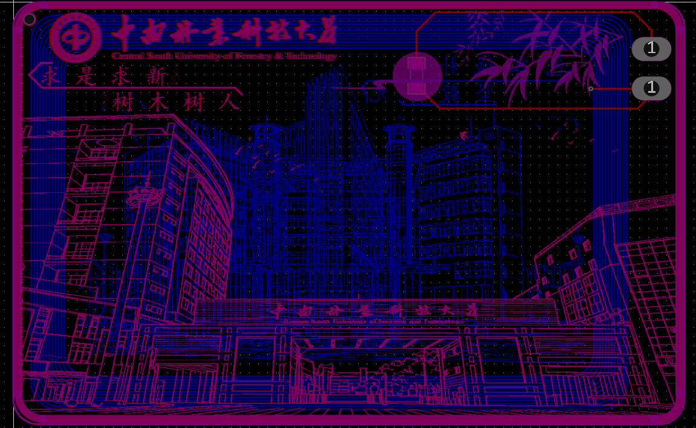
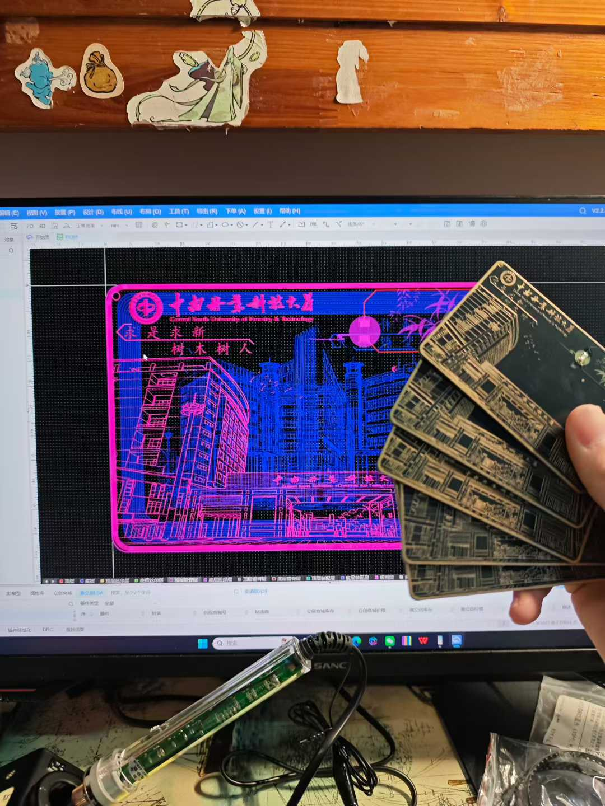

# 用嘉立创 EDA 画了一张支持 NFC 的 PCB 校园卡

> 源码：[github.com/NaHS2/CSUFT-PCB-campus-card](https://github.com/NaHS2/CSUFT-PCB-campus-card)

我在中南林业科技大学（CSUFT），学校里人手一张校园卡，图书馆、寝室门禁全用它。有段时间我对 NFC 的原理特别好奇——一张塑料卡片凭什么能在刷卡机上一碰就完成身份识别？正好嘉立创每个月给两次免费打板额度，于是决定自己画一张 CSUFT 主题的 PCB 校园卡，把"卡片内部到底长什么样"这个问题彻底搞明白。

---

## 1. 一张 NFC 卡的本质

拆开一张普通的校园卡，里面只有两样东西：**一个 NFC 芯片**和**一圈刻在塑料薄膜上的铜线圈**。线圈是这个系统里最巧妙的部分——它既是读卡器发来的电磁波的接收天线，也是芯片回传数据的发射天线，同时还能从电磁波中感应取电给芯片供电。一张被动式的 NFC 卡片里没有电池，芯片需要的能量全从读卡器发出的 13.56MHz 电磁场中获取。

画 PCB 校园卡的思路就是：在 PCB 上画一圈环形铜线当天线，焊上一个 NFC 芯片，用 PCB 基材（FR-4）代替塑料卡片本体。

---

## 2. PCB 设计

用嘉立创 EDA（立创 EDA 专业版）画的，核心设计有两个部分：

**线圈天线。** 沿着 PCB 外围画了一圈多匝环形走线，线宽和间距都参考了 NXP 官方天线设计指南。13.56MHz 的 NFC 天线不是随便画个圈就行的——匝数、线宽、间距、走线长度共同决定了天线的电感值，需要匹配芯片的输入阻抗才能保证正常通信。

**NFC 芯片封装。** 芯片用了常见的 NXP NTAG 系列，贴片封装，焊在 PCB 背面。芯片本身有 4 个引脚——2 个接线圈两端，另外 2 个是测试点。

PCB 外形按标准信用卡尺寸画（85.60mm × 53.98mm），板厚选 0.8mm（比常规 1.6mm 薄，更接近真实卡片的厚度）。实际打出来的板带着一点 FR-4 材质的淡黄色，线圈的铜走线对光能隐隐看到。

焊好芯片后，在板子正面放了 CSUFT 的校徽——手机 NFC 一靠近就能读取，拿给室友扫了一下，屏幕上弹出学校官网，几个人围着看了半天都觉得神奇。

---

## 3. 验证测试

焊完第一件事是用手机 NFC 工具 App 扫一下——读写正常，能写入文本、URL、联系方式等 NDEF 格式数据。用寝室的读卡器测试也能正常识别。还有一个有意思的功能：写入学校的 App「i 中南林」的启动链接后，手机一碰就自动打开应用。食堂的刷卡机就别想了，那个用的是另一套系统。

打板时的一块备料板故意不均匀受热烤了一下，发现线圈的 Q 值明显下降，读卡距离从 3-4cm 缩到不到 1cm。查了一下资料，FR-4 的介电常数和损耗角正切在高温下变化不小，对高频天线的影响不能忽略。

---

## 4. 关于成本

嘉立创每月两次免费打板（100mm × 100mm 以内双面板），校园卡的 PCB 尺寸刚好在免费范围内。NFC 芯片从淘宝买，几块钱一片。所以单张 BOM 成本不过几块芯片钱加上运费，远低于买现成的 NFC 标签，而且多了一份"自己画的"成就感。

---

> 这次做 PCB 校园卡，最大的收获不是得到了一张能用的卡，而是搞清楚了 NFC 从线圈到芯片的完整物理链路。如果你也想试试，强烈推荐——花一个下午画张 PCB，等一周板子寄到，焊上芯片，手机一扫就亮，那种"纸上的原理图变成了手里能用的实物"的体验，是看多少教程都替代不了的。
