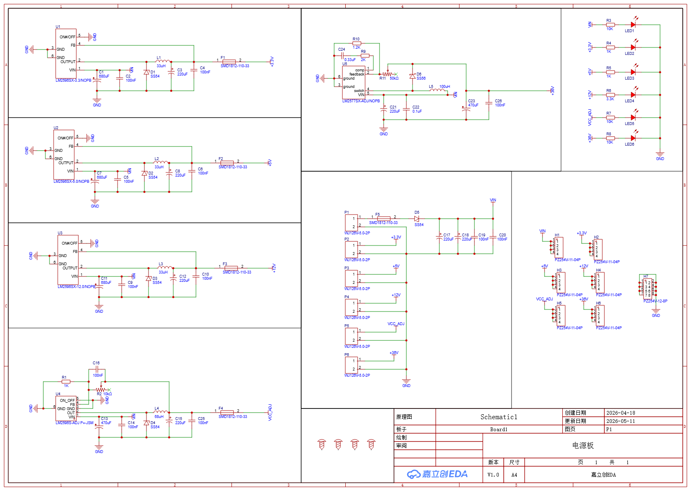
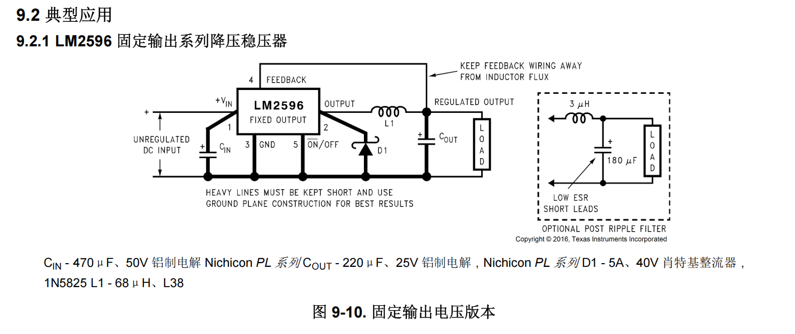
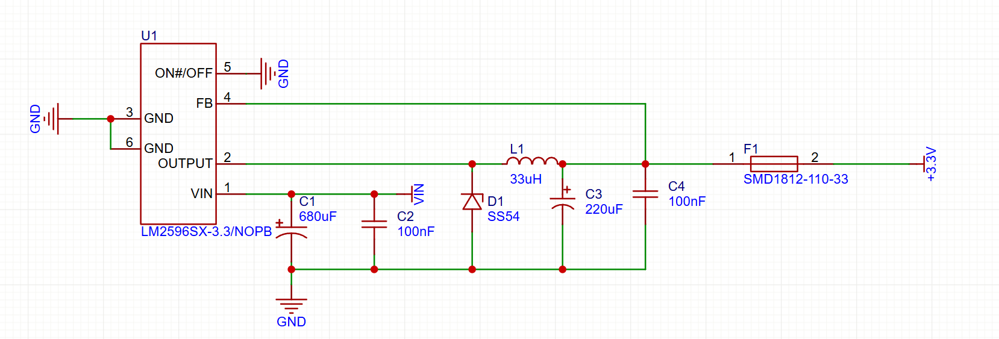
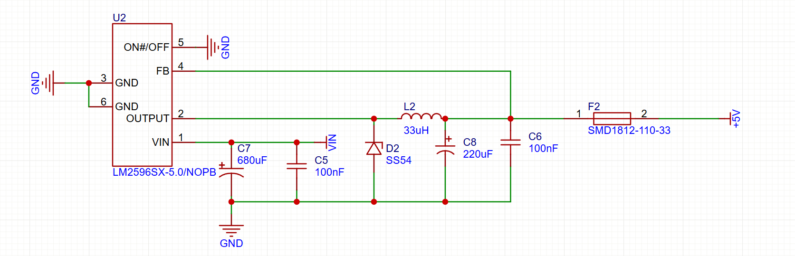
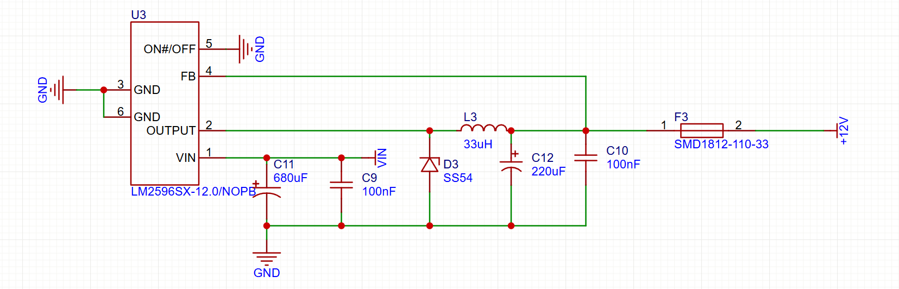
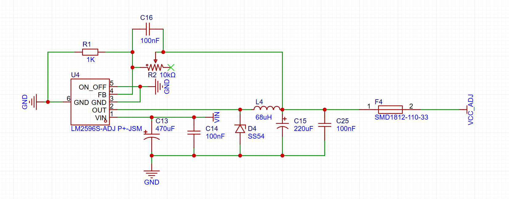
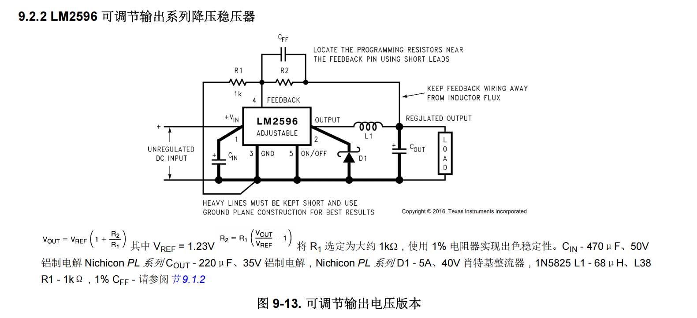
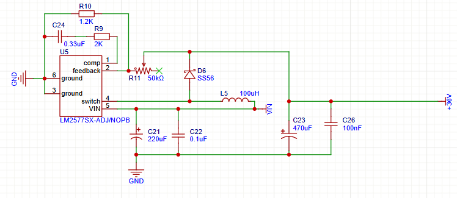
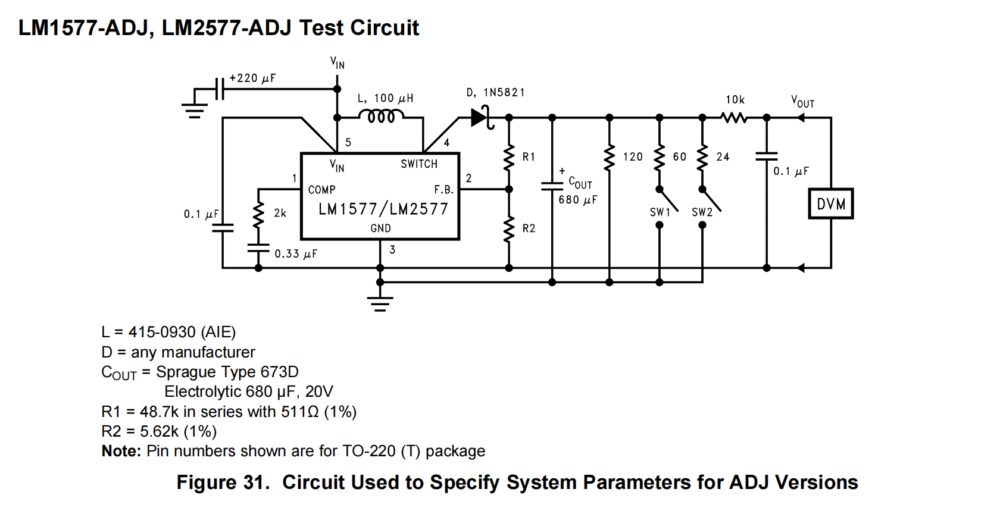
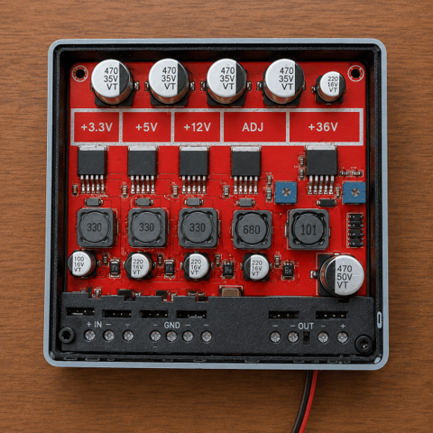

# 多路DCDC电源板：一块系统电源板的设计思路

设计电源板时，第一步不是先找一颗芯片，而是先问清楚：输入电压是多少，想得到什么输出电压，负载需要多大电流，允许多大的纹波和温升。

这块电源板的输入是一组直流电，输出需要`+3.3V`、`+5V`、`+12V`、`VCC_ADJ`和`+36V`。前四路是降压，最后一路是升压。四路降压本质上使用同一个Buck电路模板，区别主要是LM2596的固定输出型号和反馈方式不同；升压部分使用Texas Instruments（TI）的LM2577。要看懂这块板，不能只记住“这里放了一个芯片、那里放了一个电感”，而要理解每个模块怎样从输入电压得到目标电压。

图1：电源板总体原理图。左侧是四路LM2596降压，右上是LM2577升压，右侧是电源指示和输出接口。

---

## 1. 从12V得到5V：开关为什么能降压

假设有一个理想开关，输入端接`12V`，输出端暂时只接一个负载。开关接通时，负载得到`12V`；开关断开时，负载得到`0V`。

如果开关在一个周期内有`5/12`的时间接通，有`7/12`的时间断开，那么负载两端电压的平均值就是：

VAVG = 12 × 5/12 + 0 × 7/12 = 5 V

也可以写成：

VOUT ≈ D × VIN

其中**D**是开关接通时间占整个周期的比例，也叫占空比。对于`12V`降到`5V`，理想占空比就是：

D = VOUT / VIN = 5 / 12 ≈ 41.7%

这就是开关型降压电源的基本思想：不是把多余的`7V`直接烧掉，而是用开关控制“输入能量送过来的时间比例”。开关本身只有导通和关断两种状态，理想情况下功耗很小，所以效率比线性降压高。

但此时输出并不是稳定的`5V`，而是在`12V`和`0V`之间快速跳变。接下来要解决两个问题：

- 电压在开关过程中突然变化，怎样把它变平滑？
- 负载需要连续电流，怎样让电流不要随着开关立即变成零？

---

## 2. 电压突变用电容，电流突变用电感

### 2.1 电容为什么放在输入和输出两边

电容两端电压不能突变，基本关系是：

iC = C × dvC/dt

当开关节点突然升高时，电容先充电；当开关节点突然降低时，电容释放之前储存的能量。因此，电容可以把脉冲电压“撑住”，抑制电压突变。

这块板中，LM2596每一路输入端都有`680uF`电解电容和`100nF`陶瓷电容，输出端有`220uF`电解电容和`100nF`陶瓷电容。

它们不是重复放置的：

- `680uF/220uF`电解电容容量大，负责低频储能和负载突变；
- `100nF`陶瓷电容高频阻抗低，负责吸收开关边沿带来的高频噪声。

所以输入端的电容主要解决“开关从输入端突然取电”的问题，输出端的电容主要解决“负载端电压不能跟着开关跳变”的问题。

### 2.2 电感为什么串在输出回路

电感两端电压与电流变化率的关系是：

vL = L × diL/dt

电感电流不能突变。开关导通时，输入电压给电感充能，电感电流逐渐上升；开关关断时，电感会继续推动原来的电流流向负载，电流逐渐下降，而不会立刻变成零。

因此，降压电路的工作逻辑是：

1. 开关导通，电感储能，电流上升；
2. 开关关断，电感放能，电流下降但仍然连续；
3. 电容吸收电流变化产生的电压波动；
4. 负载得到近似稳定的直流电。

电感解决的是电流连续问题，电容解决的是电压平滑问题。二者缺一不可：只有电容没有电感，开关电流仍然会产生很大尖峰；只有电感没有电容，输出电压仍会有明显纹波。

---

## 3. 开关关断以后，电感电流从哪里走

开关管关断时，电感会努力维持原来的电流方向。如果没有续流路径，电感两端会产生很高的反向电压，开关管和芯片可能被击穿。

因此降压电路必须放置续流二极管。二极管的逻辑不是“整流一下”这么简单，而是：

- 开关导通时，二极管截止；
- 开关关断时，电感电流通过二极管流向负载；
- 下一次开关导通后，二极管再次截止。

板上的降压支路使用`SS54`肖特基二极管，是因为它具有较低的正向压降和较快的开关速度。二极管损耗大致为：

PD ≈ VF × ID

所以选型时要同时看正向电流、反向耐压、正向压降和温升，不能只看“额定电流够不够”。

---

## 4. LM2596在电路中具体做什么

到这里，已经可以得到一个完整的Buck降压框架：

`输入电容 → 开关管 → 电感 → 输出电容`，并在开关节点配置续流二极管。

LM2596的作用就是把开关管、振荡器、误差放大器和反馈控制集成起来。它不断检测反馈引脚的电压：

- 输出电压低于目标值时，增加有效导通时间，向负载传递更多能量；
- 输出电压高于目标值时，减少有效导通时间，传递更少能量。

因此，前面的**D = VOUT / VIN**只是理想估算，实际占空比会随着输入电压、负载电流、二极管压降和芯片损耗自动调整。

这也解释了为什么四路降压电路看起来几乎一样：它们共享同一套“开关管—续流二极管—电感—输出电容”的功率级，LM2596负责控制开关。只要输入范围、输出电压和负载电流满足条件，就可以复用这套Buck拓扑。

TI数据手册给出的固定输出典型应用电路也是这个结构：输入端有`CIN`，芯片的开关输出接到电感，二极管从开关节点接地，电感后面接`COUT`和负载，反馈线从电感后的稳定输出端取样。

参考图：LM2596固定输出典型电路。图中的粗线强调了输入电容、开关节点、二极管、电感和输出电容组成的高电流回路应尽量短；反馈线则要避开电感磁通和开关噪声。

### 4.1 `+3.3V`降压模块

图2：`+3.3V`降压模块。U1是LM2596SX-3.3/NOPB，采用固定反馈设定输出电压。

这个模块使用固定输出版本LM2596SX-3.3/NOPB，是因为目标就是稳定得到`3.3V`，不需要把反馈电阻放到外部调节。固定输出芯片内部已经配置了对应的反馈关系，外围只需要完成输入滤波、功率传递、续流和输出滤波。输入端的`C1=680uF`和`C2=100nF`吸收输入扰动，`L1=33uH`负责能量传递，`D1=SS54`负责关断期间续流，`C3=220uF`和`C4=100nF`负责输出滤波，最后由`F1`把该路输出引出并提供故障隔离。

### 4.2 `+5V`降压模块

图3：`+5V`降压模块。U2是LM2596SX-5.0/NOPB。

它与`+3.3V`模块使用完全相同的降压逻辑，主要差别是U2换成了LM2596SX-5.0/NOPB。这个固定输出版本内部已经把反馈目标设定为`5V`，所以不需要像ADJ版本那样增加外部电阻分压。`L2=33uH`、`D2=SS54`、`C8=220uF`和`C6=100nF`共同组成输出级，`F2`用于把负载短路限制在`+5V`支路内。

### 4.3 `+12V`降压模块

图4：`+12V`降压模块。U3是LM2596SX-12.0/NOPB。

这一路仍然复用同一个LM2596 Buck模板，只是U3采用LM2596SX-12.0/NOPB，内部反馈目标改成`12V`。它仍然使用`680uF + 100nF`输入滤波、`33uH`电感、`SS54`续流和`220uF + 100nF`输出滤波。若后级带有电机或其他执行机构，选型时更需要关注启动电流、电感饱和电流、保险丝动作特性和铜箔压降。

---

## 5. 如果不使用开关，线性降压有什么问题

另一种直观方法是串联一个晶体管或线性稳压器，把多余电压变成热量。例如用线性方式把`12V`降到`5V`，负载电流为`1A`时，稳压器需要消耗：

PLOSS = (12 − 5) × 1 = 7 W

这`7W`全部变成热量。输出功率只有：

POUT = 5 × 1 = 5 W

效率约为：

η = 5 / 12 ≈ 41.7%

线性稳压的优点是电路简单、噪声较低、没有开关节点；缺点是输入输出压差越大、负载电流越大，发热越严重。因此，低电流、低噪声场合可以考虑线性稳压；大压差、大电流场合更适合开关电源。

---

## 6. 可调降压：为什么要把反馈电阻引出来

固定的`3.3V`、`5V`和`12V`可以使用固定输出芯片，但如果希望输出电压可调，就不能把反馈网络固定在芯片内部，而要把反馈电阻放到外部。这是固定输出支路和可调输出支路最重要的区别：功率级没有变，变化的是“芯片如何知道输出电压已经达到目标”。

图5：`VCC_ADJ`可调降压模块。U4使用LM2596S-ADJ，R1、R2和电位器组成反馈网络。

可调降压模块的逻辑是：输出电压经过电阻分压后送回FB引脚，芯片将FB电压与内部参考电压比较，然后自动调节占空比。输出变低时，FB电压也变低，芯片增加导通时间；输出变高时，FB电压变高，芯片减少导通时间。

参考图：LM2596可调输出典型电路。与固定输出版本相比，最大的变化是FB引脚不再使用芯片内部固定反馈，而是由输出端经过R1、R2分压后反馈回来；CFF用于改善反馈环路的高频响应。

反馈关系可以写成：

VOUT = VFB × (1 + RTOP / RBOT)

R1、R2和电位器的作用不是“限制电流”，而是“告诉芯片当前输出电压是多少”。调节电位器相当于改变分压比例，芯片会把输出调节到新的目标值。C16并联在反馈网络上，用于抑制反馈线上的高频干扰、改善环路响应。输出侧使用`L4=68uH`，最终仍要结合负载电流和开关频率核算。

调节电位器时要先空载测量，确认输出不会超过后级器件耐压，再接入负载。可调电源最危险的地方不是不能输出，而是误调后仍然能输出一个看似正常、实际已经过高的电压。

---

## 7. 升压：为什么电感的位置和能量方向变了

降压是把较高输入电压变成较低输出电压；升压则是先把输入能量储存在电感中，再把电感两端的电压叠加到输入电压上送到输出端。

### 7.1 Boost的两个状态

升压电路同样有两个阶段：

1. 开关管导通：输入电压加在电感上，电感电流上升，电感储能；
2. 开关管关断：电感为了维持电流，会把自身电压抬高，电感电压与输入电压一起经过二极管给输出电容充电。

理想连续电流模式下：

VOUT ≈ VIN / (1 − D)

例如输入`12V`、输出`36V`时：

D ≈ 1 − 12 / 36 = 66.7%

升压不能只看输出电流，因为输入电流会变大。功率守恒并考虑效率后：

IIN ≈ (VOUT × IOUT) / (η × VIN)

假设输出`36V/1A`、效率按`85%`估算：

IIN ≈ (36 × 1) / (0.85 × 12) = 3.53 A

所以升压模块的输入端、电感、保险丝和输入电容，都要按约`3.53A`以上的实际工作电流进行校核。

### 7.2 `+36V`可调升压模块

图6：`+36V`可调升压模块。U5使用LM2577SX-ADJ/NOPB，L5为`100uH`，D6为SS56，输出侧使用`470uF`和`100nF`电容。

TI给出的LM2577-ADJ典型电路也遵循同一条升压逻辑：输入电容稳定输入端，电感接在输入与开关节点之间，芯片关断时电感电流经过二极管流向输出，输出电容储能，反馈电阻分压后回到FB引脚。

参考图：LM2577-ADJ典型升压电路。它与本板的`+36V`支路在功能结构上对应，但实际电感、二极管、电容和反馈阻值仍需要根据输入范围、输出功率和目标电压重新计算，不能直接照抄测试电路的数值。

这个模块中，`L5`负责储能，`D6`负责开关关断时把能量送到输出端，`C23=470uF`承担升压后的低频储能，`C26=100nF`旁路高频噪声。R9、R10和R11构成反馈和调节网络，C24用于补偿和改善控制环路。

升压二极管选择`SS56`而不是只看“能不能导通”，还要检查反向耐压、平均电流、正向压降和开关速度。输出电容的耐压也必须高于`36V`，并为启动过冲和负载变化留出余量。

---

## 8. 电感和电容到底怎样计算

### 8.1 Buck电感

降压电感纹波电流可估算为：

ΔIL = (VIN − VOUT) × D / (L × fs)

反过来可以根据允许的纹波电流选电感：

L = (VIN − VOUT) × D / (ΔIL × fs)

一般可以把**ΔIL**取最大负载电流的`20%~40%`作为初始设计值。电感峰值电流为：

IL,PEAK = IOUT + ΔIL / 2

电感饱和电流必须高于这个峰值，并且还要考虑启动和负载突变。

### 8.2 输出电容

忽略ESR时，电容导致的输出纹波近似为：

ΔVC ≈ ΔIL / (8 × fs × COUT)

ESR造成的纹波约为：

ΔVESR ≈ ΔIL × ESR

因此输出电容不是容量越大越好，还要看耐压、纹波电流、ESR以及芯片数据手册允许的范围。

### 8.3 保险丝和指示灯

保险丝需要根据正常电流、启动浪涌、环境温度和允许动作时间选择，不能机械地按“额定电流等于负载电流”来定。

电源指示LED需要串联限流电阻：

R = (VRAIL − VF) / ILED

例如在`12V`轨上使用正向压降约`2V`、工作电流约`2mA`的LED：

R ≈ (12 − 2) / 0.002 = 5 kΩ

---

## 9. PCB Layout：为什么器件摆放顺序很重要

开关电源的原理图只说明“哪些点相连”，并没有说明电流在PCB上走多远、经过多大的寄生电感，也没有说明反馈线会不会被开关节点干扰。因此，LM2596和LM2577能不能稳定工作，很大程度上取决于PCB布局。

### 9.1 先找出高电流、高变化率回路

布局前先不要急着摆器件，而是把每一路的功率回路画出来。

以Buck降压为例，最需要缩短的是：

`输入电容正端 → 芯片VIN/开关管 → 开关节点 → 肖特基二极管/电感 → 输出电容 → GND → 输入电容负端`。

这个回路中的电流变化很快，寄生电感越大，开关瞬间产生的电压尖峰越高。因此：

- 输入电容必须靠近芯片的`VIN`和`GND`引脚；
- 肖特基二极管必须靠近芯片的开关输出脚和地；
- 电感紧接在开关节点之后；
- 输出电容放在电感后面，并靠近负载电源出口；
- 这条高频大电流回路的铜箔要短、宽、连续，尽量不要绕路。

不能把输入电容放在板子一端、芯片放在中间、二极管和电感放在另一端，再用细长走线连接。原理图上虽然仍然连通，但寄生参数会让尖峰、纹波和EMI明显变差。

### 9.2 Buck模块的推荐摆放顺序

每一路降压可以按照“输入到输出”的方向排列：

`输入端子/保险丝 → 输入电容 → LM2596 → 肖特基二极管和电感 → 输出电容 → 输出保险丝/端子`。

其中，输入电容和芯片应当优先摆放，二极管和电感围绕芯片的开关节点布置，最后再放输出电容和输出端子。这样做的目的，是让功率流向清晰，减少交叉走线。

`100nF`陶瓷电容应尽量贴近芯片引脚，电解电容可以放在旁边承担较低频的储能。电感不要紧贴反馈电阻和FB走线，避免电感磁场耦合到反馈网络。

### 9.3 反馈线必须远离电感和开关节点

固定输出版本的反馈点位于电感之后的稳定输出侧；可调版本的R1、R2和电位器则构成FB分压网络。反馈线传输的是很小的检测信号，不应该和开关节点、二极管阳极、芯片开关输出脚平行长距离走线。

布局时建议：

- R1、R2和CFF/C16靠近芯片FB引脚；
- FB取样点放在输出电容之后，而不是直接取开关节点；
- 反馈线远离电感和肖特基二极管；
- 反馈电阻的地端回到芯片信号地，避免与大电流回流共用一段细长铜线；
- 不要让电感或大电流铜皮从反馈网络下方穿过。

这也是芯片手册典型图中特别强调“反馈布线远离电感磁通”的原因。反馈一旦被噪声污染，芯片就会误以为输出电压在变化，产生额外的占空比抖动。

### 9.4 地线和铺铜

电源板上的GND不是“随便找一根线接回去”就可以。输入电容负端、续流二极管地端、芯片功率地和输出电容负端之间，应根据芯片参考设计安排短而粗的回流路径。

多路电源可以共用大面积地平面，但每一路的高频功率回流应尽量在本路内部闭合，避免`+12V`电机电流经过`+3.3V`逻辑电源附近的地线。输出接口的信号地和功率地要有明确连接点，不能让大电流端子和反馈地共用一条很细的走线。

### 9.5 功率器件与散热

LM2596、LM2577、肖特基二极管和电感都是主要发热源，器件周围应留出足够铜皮和空间：

- 芯片散热焊盘尽量连接到大面积铜皮；
- 肖特基二极管两端铜箔要满足电流和散热要求；
- 电感周围留出空间，避免贴近反馈线和敏感信号；
- 高温器件不要紧贴大容量电解电容；
- `+36V`升压支路的电感、二极管和芯片应优先检查温升；
- 高电流端子和保险丝附近使用较宽铜箔，减少压降和局部发热。

器件功耗可以先粗略估算：

PLOSS = PIN − POUT

如果转换效率为**η**，则：

PLOSS = POUT × (1 / η − 1)

功耗最终会转化为热量，所以布局阶段就要为散热留出条件，而不是等到实物发烫后再补救。

### 9.6 多路电源板的分区原则

这块板上有五条电源轨，布局时不能只按“元器件能不能放下”来排版，还要按功率等级分区：

- `+3.3V`和`+5V`靠近低压逻辑侧，缩短敏感输出走线；
- `+12V`靠近执行机构接口，使用更宽的电源和地线；
- `+36V`独立布置升压芯片、电感、二极管和高耐压电容；
- `VCC_ADJ`的电位器和反馈网络远离其他支路的开关节点；
- 输入保险丝靠近电源入口，使故障电流尽早被限制；
- 电源指示LED和输出丝印放在便于观察和测量的位置。

这样布置以后，调试时可以按照“输入—转换级—输出—负载”的顺序逐级测量，也能减少高功率支路对低压逻辑支路的干扰。

---

## 10. 最后把设计逻辑串起来

设计这块板时，可以按照下面的顺序思考：

1. 先根据输入和输出决定使用降压、升压还是线性稳压；
2. 如果使用开关变换，根据目标电压估算占空比；
3. 因为开关会带来电压突变，所以输入和输出要放电容；
4. 因为负载电流不能突变，所以功率回路要放电感；
5. 因为开关关断时电感仍要维持电流，所以要放续流二极管；
6. 根据输出电流和纹波计算电感、电容，并校核饱和电流和温升；
7. 用反馈电阻让芯片知道输出是否达到目标电压；
8. 用保险丝把不同负载分开，避免一路故障拖垮全部输出；
9. 最后再进行PCB布局，让大电流回路短而宽，反馈线远离开关节点。

图7：完成装配后的电源板。板上不同电源轨分别标识，功率器件和输出接口按照电流路径布置。

> 电源设计不是先背芯片型号，而是先理解能量怎样流动：开关决定能量传递的时间，电感负责让电流连续，电容负责让电压平滑，二极管负责给电感提供退路，反馈网络负责把输出拉回目标值。理解了这条逻辑，固定降压、可调降压和升压电路就不再是几张孤立的原理图。
