# 从 100 个焊点到 0-99 计数器：电子线路课设的两块万用板

大二下学期末的电子线路课程设计，两周时间，两个项目。第一个是 **LM358P 运放驱动 LED**，主打焊接基本功——万用板上 100 多个焊点，从拿烙铁手抖到焊完验收；第二个是 **NE555 + CD40110 搭 0-99 计数器**，侧重数字逻辑——NE555 产生秒脉冲，两片 CD40110 级联计数译码驱动，再加一套 20 秒锁存复位的时序控制。

一个模拟放大电压，一个数字计数脉冲。两块万用板从面包板搭到焊完验收，把运放放大、多谐振荡、计数译码全走了一遍。

---

## 1. 项目一：LM358P 运放 LED 驱动

### 1.1 要做什么

第一个任务很直接：用 LM358P 双运放搭一个两级放大电路，输入毫伏级电压，输出驱动 LED，亮度随输入电压变化。除了功能，焊点数量和焊接质量也占评分——100 个焊点起步，焊点饱满度、引脚间距、有无虚焊，老师拿着放大镜一个一个看。

### 1.2 两级放大设计

LM358P 内部有两个独立的运放，正好串成两级同相放大：

- **第一级**：输入 18.4mV → 输出 560mV，放大 ≈ 30 倍
- **第二级**：输入 560mV → 输出 4.08V，放大 ≈ 7 倍
- **总增益** ≈ 210 倍，毫伏级信号推动 LED 绰绰有余

反馈网络的关键电阻：第一级负反馈 222Ω 定增益，第二级 68Ω / 6.8Ω 做分压，输出端串一个 680Ω 限流保护 LED。LM358P 的 1 脚出第一级 560mV，7 脚出第二级 4.08V——两个运放各干各的，信号一路向右流。

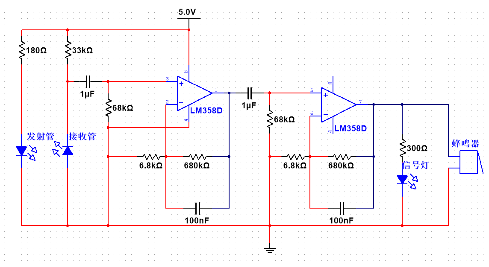

Multisim 仿真先跑了一遍。给输入端注 18.4mV 直流，虚拟示波器同时挂 1 脚和 7 脚：1 脚稳在 560mV，7 脚 4.08V，波形干净。顺手在输入端叠了 50Hz 工频干扰模拟真实噪声环境——输出纹波不到 20mV，LM358P 自身的带宽限制把高频噪声自然衰减了。

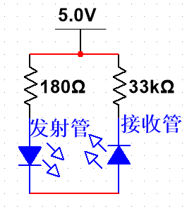

### 1.3 焊接

面包板上插接和万用板上焊接是两件完全不同的事。面包板拔插随便改，万用板一焊上去就定型了。焊接顺序吃过亏之后才总结出来：

1. **先焊芯片座**，别把芯片直接焊上去——烙铁 350°C 靠太近几秒钟就能烫坏芯片
2. **再布电源轨**，板子边缘拉两条锡轨做 Vcc 和 GND 总线
3. **从输入往输出焊**，每焊一个元件用万用表测一下通断
4. **最后插芯片**，确认电源极性无误再上电

100 多个焊点对老手来说十分钟的事，对第一次正经拿烙铁的新手完全是另一回事。我最开始几个焊点锡量太多，相邻两个引脚差点短路；后面又矫枉过正，锡量太少导致焊点灰暗不亮——助焊剂挥发完了锡还没流平。焊到三四十个之后手感才慢慢上来：烙铁接触焊盘和引脚的交界处，锡丝从对面送进去，看到锡润湿整个焊盘立刻撤烙铁，全程不超过两秒。

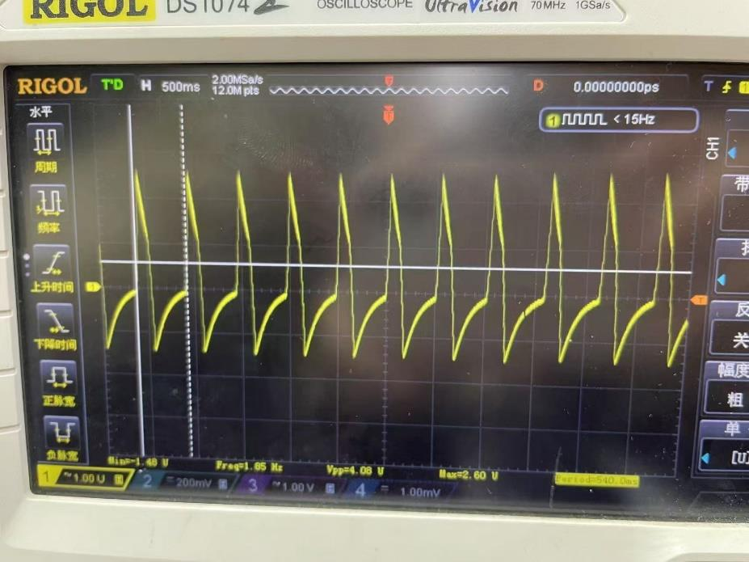

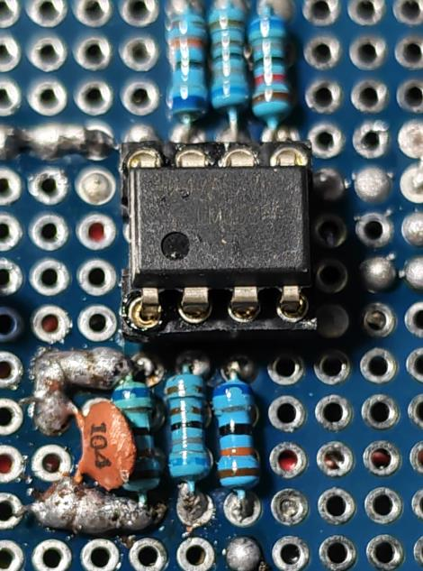

### 1.4 上电调试

上电前反复确认了电源极性——反接烧芯片是新手最容易犯的错。输入端加 18.4mV，万用表一路量过去：1 脚 560mV，7 脚 4.08V，LED 限流电阻两端压差正常。旋动输入电压，LED 从微亮平滑过渡到全亮。

遇到一个问题：输入悬空时 LED 微弱发光。LM358P 输入阻抗极高，悬空引脚耦合了环境中的 50Hz 工频电场，被 210 倍放大后足够让 LED 微微点亮。在输入端并了一个 10kΩ 到地——悬空强制拉低，接入信号时 10kΩ 远大于信号源内阻，不影响测量。问题解决。

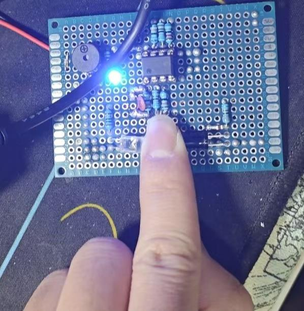

---

## 2. 项目二：NE555 + CD40110 的 0-99 计数器

### 2.1 要做什么

第二个项目从模拟跳到了数字，要求搭一个 0-99 循环计数器，带 20 秒自动锁存复位：

- NE555 多谐振荡器产生 1Hz 时钟
- 两片 CD40110 级联，个位计满进位到十位
- 计到 20 时自动锁存显示，保持一两秒后清零重新计数

如果说第一个项目的难点在焊接工艺，这个项目的难点全在时序——锁存慢了数字跳过去，复位快了数字还没稳住就没了。

### 2.2 NE555 时钟源

NE555 接成无稳态多谐振荡，输出连续方波。频率公式：

$$f = \frac{1}{0.7(R_1 + 2R_2)C}$$

R₁ = 10kΩ、R₂ = 10kΩ、C = 47μF 电解电容，算出来约 1.01Hz。实物用示波器抓到 3 脚，实际频率 1.04Hz——和理论偏差不到 4%，对于电解电容 ±20% 的公差来说已经很准了。如果追求更高精度，换钽电容或者直接用晶振分频替代 555 都行，但课设要求里 1Hz 只要肉眼看不出明显快慢就行。

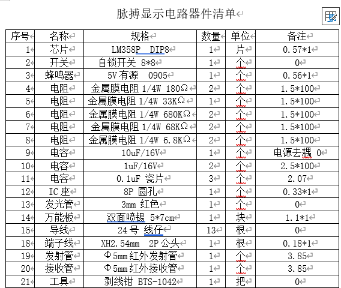

### 2.3 CD40110：一颗芯片干三件事

CD40110 是整个电路里我最喜欢的一颗芯片——计数、译码、段驱动全集成在一个 DIP-16 封装里。一片管一个数码管（0-9），进位输出给下一片，两片级联就是 00-99。

| 引脚 | 功能 |
|------|------|
| 9 (CPu) | 加法计数时钟，上升沿 +1 |
| 10 (Qco) | 进位输出，9→0 时出一个正脉冲 |
| 5 (R) | 复位，高电平清零 |
| 6 (LE) | 锁存使能，高电平冻结显示 |
| 4 (TE) | 消隐，高电平熄灭数码管 |
| 1–3, 11–15 | a–g 七段输出，直接接数码管 |

NE555 的 3 脚方波 → 第一片 CD40110 的 CPu → 0–9 计数 → Qco 进位 → 第二片 CD40110 的 CPu → 十位加 1。整个时钟链只有一根跳线。

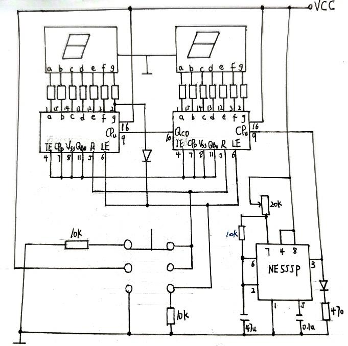

### 2.4 20 秒锁存与复位

这是整个设计里最烧脑的部分。逻辑分三步：

**计数（0→19）**：555 每秒一个脉冲，数码管 00→01→02…一路往上跑，一切正常。

**锁存（到达 20）**：数码管显示"20"时，十位 g 段呈现"2"的特征段码，个位 g 段呈现"0"的特征段码。组合逻辑门检测到这个状态，立即拉高 LE 锁存——数码管冻结在"20"。

**复位（锁存后）**：锁存保持约一两秒让人眼看清"20"，然后 RST 拉高清零计数器，同时释放 LE，回到"00"重新开始。

调试时踩了一个时序坑：锁存和复位信号如果同时到达，CD40110 会先锁存一个不确定的中间值再清零，数码管在"20"→"00"之间闪一下乱码。原因是逻辑门的传播延迟不同——锁存路径和复位路径的门级数不一样，信号到达有先后。解决方法很简单：在锁存释放和复位生效之间插一个 RC 积分电路（10kΩ + 4.7μF），延迟约 50ms。不加这个延迟肉眼完全能看到那个一闪而过的乱码。

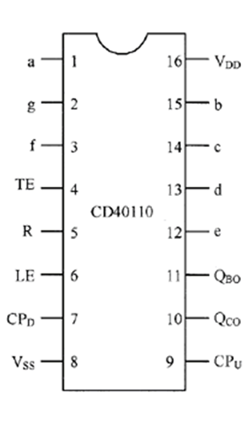

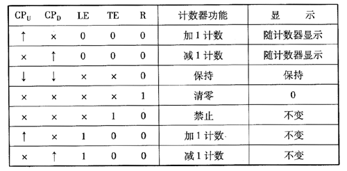

### 2.5 焊接与分级调试

两片 CD40110 加 NE555、两个数码管、一堆电阻电容——万用板上的走线密度比第一个项目高了一倍不止。走线策略：先布电源（Vcc/GND 用粗线走板子边缘），再布时钟和进位（信号线尽量短），最后焊七段线（8 根线 × 2 个数码管，最花时间）。

调试按模块分级推进，这是从第一个项目学到的教训——不要一口气焊完再上电：

1. NE555 单独测：示波器挂 3 脚，确认 1Hz 方波正常
2. 接入第一片 CD40110：看数码管 0→9 循环是否正常
3. 级联两片：确认 00→99 循环
4. 加上锁存复位电路：跑完整 0→20→锁存→复位→00 循环

第三步果然出问题了——个位计到 9 之后十位纹丝不动。排查了半天发现 Qco（10 脚）到第二片 CPu（9 脚）的跳线忘了焊。典型的"眼睛看着原理图觉得连上了，手上根本没碰那根线"。补焊之后一切正常。

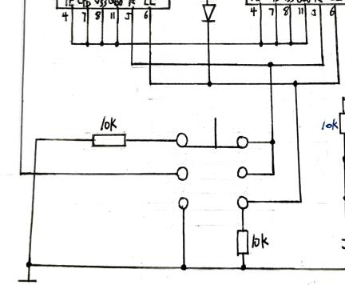

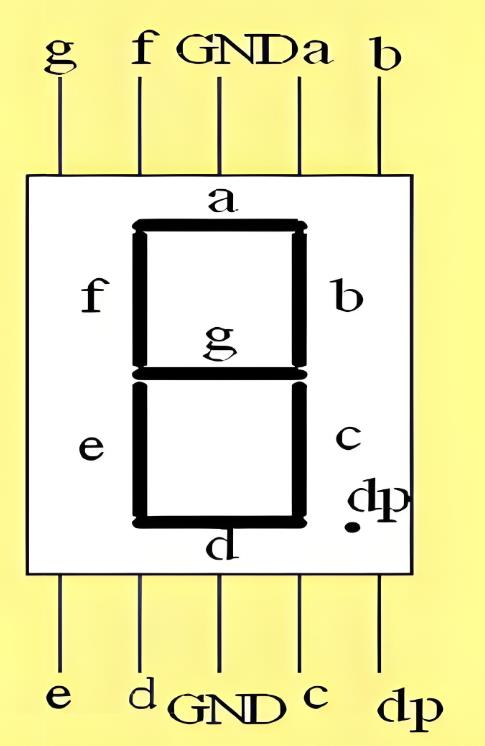

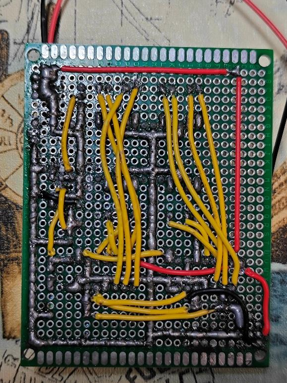

---

## 3. 两块板子之后的感受

两个项目合在一起，正好覆盖了硬件开发的两个基本面：

**模拟这边**，运放的放大倍数不是算出来就完了——反馈电阻的精度、输入阻抗的匹配、工频噪声的耦合路径，这些东西在 Multisim 仿真里安安静静，上了实物万用表一量全是问题。焊错一个 222Ω 的电阻，放大倍数就不是 30 倍；输入忘了接下拉，LED 就在那鬼火一样微微亮。

**数字那边**，时序是一切。555 的方波占空比偏一点无所谓，CD40110 的锁存和复位谁先谁后就是大问题。仿真里所有门电路零延迟，实物上每多一级门就多几纳秒——在 1Hz 的世界里几纳秒无所谓，但如果以后做高速数字电路，这个意识要提前建立。

焊接这件事也一样——前 30 个焊点还在纠结烙铁怎么拿，焊到第 80 个的时候已经能一边聊天一边焊了。手艺这种东西没有捷径，就是焊得多了手自己记住了。

> 模拟和数字在课本上是两门课，但在这两周的课设里变成了同一个问题的两面。模拟放大的是电压，数字计数的是脉冲——但它们都在同一块万用板上工作，用同一台电源供电，用同一台示波器调试。课设最有价值的不是那两块板子本身，而是第一次把"纸上电路"变成"板上实物"的完整过程——从仿真到焊接、从上电到排错、从"为什么不行"到"原来如此"。
