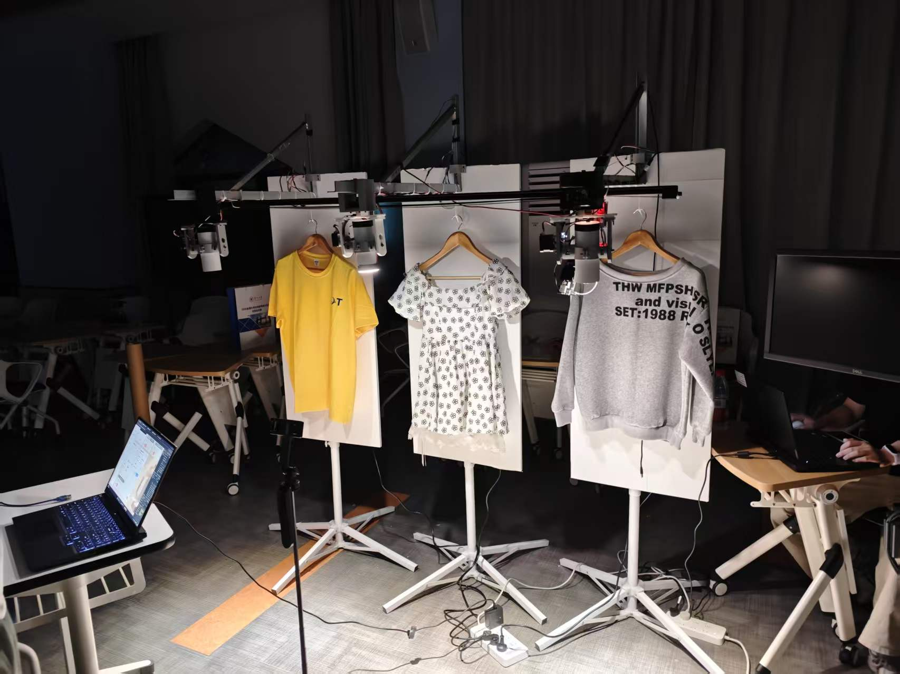
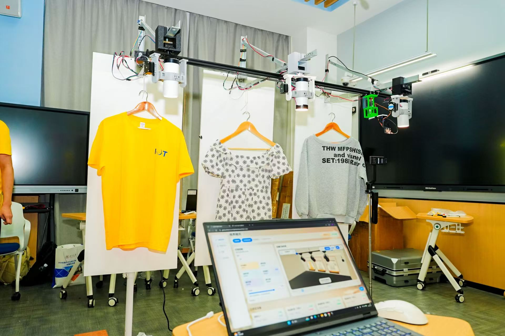
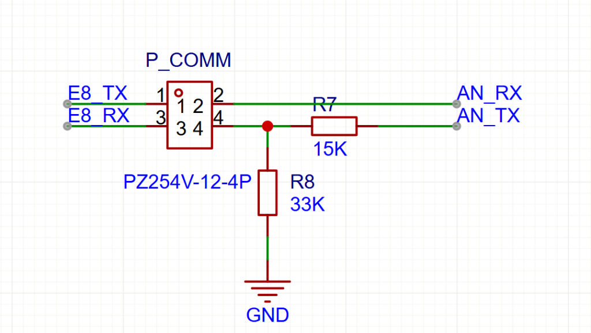

# 一条滑轨，三个灯位：智能美学追光系统的整体架构设计

> 整体硬件与固件源码：[NaHSIT/smart-aesthetic-lighting](https://github.com/NaHSIT/smart-aesthetic-lighting)

2026年，我参与设计的项目“视界随光——基于视觉感知的智能美学追光系统”在全国大学生物联网设计竞赛中获得了全国一等奖。它面向的是服装展示场景：顾客靠近某个展示区后，系统先判断顾客所在的位置，再让一台安装在后滑轨上的视觉节点移动到对应区域，采集服装图像并交给服务器分析，最后根据服装颜色、面料、顾客位置和环境光，自动调整灯具的亮度、色温、光束状态和照射方向。

这套系统最有意思的地方，不是单独用了ESP8266、ESP32-CAM或TMC2208，而是把它们组织成了一个“一动三定”的结构：后方一条滑轨带着视觉节点在三个服装位置之间移动，前方三个固定灯位分别负责左、中、右三个展示区。相机负责看，服务器负责理解，灯具负责照，滑轨和云台负责把这些判断真正变成空间上的动作。

下面我从整机工作流程开始，记录这套系统的硬件组成、节点分工和控制链路。



图1：项目在比赛现场的实际部署效果。前方是三个服装展示位和灯具，后方滑轨承载移动视觉节点，现场终端用于查看系统状态和控制结果。



图2：项目实际部署与控制台展示。可以看到后滑轨、三个灯位、服装展示板、灯具二轴云台以及运行控制台。

---

## 1. 先看整体：一台移动视觉节点，三个固定灯节点

这套作品不是一个单节点设备，而是由一个后滑轨视觉节点和三个前滑轨灯节点组成。

```text
                         Web / App / 微信小程序
                                  │
                                  ▼
                    Spring Boot后端 + MySQL数据库
                         │                  │
                服装识别 / 人流检测AI        │设备状态、控制指令
                         │                  │
                         └──────────┬───────┘
                                    │
       ┌────────────────────────────┴────────────────────────────┐
       │                                                         │
       ▼                                                         ▼
 后滑轨视觉节点                                             前滑轨三个灯节点
 ESP8266 + HUSKYLENS                                    Lamp-Left / Center / Right
 ESP32-CAM + 舵机云台                                  ESP8266 + ToF + BH1750
 Arduino Nano + TMC2208                                冷暖LED + 电雾膜 + 灯具云台
       │                                                         │
       └─────── 后滑轨定位、服装拍摄、人体检测 ────────▶ 灯光执行与状态反馈
```

后滑轨的有效行程约为`0~1200mm`，三个前滑轨灯节点分别安装在`x=200mm`、`600mm`和`1000mm`附近，对应左、中、右三个展示区。视觉节点不需要为每个区域单独配一套摄像头，而是沿后滑轨移动到被触发的区域，完成拍照和追踪任务后再服务其他区域。

这个结构把“视觉覆盖范围”和“灯具执行范围”拆开了：后滑轨负责把相机送到合适的位置，前滑轨上的三个灯位负责固定区域的照明。相机不需要和灯具安装在同一个位置，灯光也不需要跟着相机一起移动，二者通过坐标换算和通信协同起来。

---

## 2. 一次自动照明任务是怎样完成的

整套系统的自动流程可以拆成几个连续阶段。

### 2.1 无人时，三个灯节点维持基础照明

每个灯节点都有自己的基础亮度和色温。没有顾客靠近时，灯具不会简单地全部关闭，而是根据门店保存的基础参数工作，同时读取BH1750环境照度，让自然光较强时适当降低亮度，环境变暗时再平滑提高亮度。

这套基础状态很重要，因为自动推荐并不是系统唯一的照明状态。顾客离开、视觉丢失、图像识别失败或服务器暂时不可用时，灯具都应该有一个可以回退的目标。

### 2.2 ToF检测到顾客后，触发对应区域

三个灯节点分别使用VL53L0X检测本区域的距离。系统不会因为一次短暂的距离变化就立即启动滑轨，而是要求距离低于阈值并持续一段时间，以过滤手臂经过、反射异常和单次噪声。

当某个区域被确认有顾客靠近后，系统记录区域编号、灯节点ID、距离和时间，并把任务交给后滑轨视觉节点。如果视觉节点此时正在服务另一个区域，调度逻辑会根据当前任务阶段决定等待、排队还是切换，避免滑轨在多个任务之间频繁往返。

### 2.3 滑轨把ESP32-CAM送到服装位置

视觉节点安装在后滑轨托盘上，托盘上集成ESP8266、HUSKYLENS、ESP32-CAM和舵机云台。收到区域任务后，ESP8266先让Arduino Nano控制滑轨移动到对应的横向位置。

三个服装位置分别对应左、中、右三个区域。执行自动服装拍摄时，滑轨会带着ESP32-CAM依次移动到设定位置，在每个位置停稳后再拍照，避免滑轨运动中的模糊画面进入识别流程。相机拍摄完成后，将JPEG图像上传到服务器。

这里的滑轨不是简单的“让相机左右移动”，它实际上承担了视觉节点共享的任务调度：一套视觉硬件覆盖三个展示位置，既节省了节点数量，也让三个区域使用同一套相机和识别流程。

### 2.4 服务器分析服装，再生成照明参数

服务器收到ESP32-CAM上传的服装图像后，交给AI服务处理。识别结果不只是一句“这是一件衣服”，而是会进一步拆解为：

- 服装类别，例如上装、裤装、连衣裙；
- 穿搭结构，例如单独上装、上装与下装组合或连衣裙；
- 服装区域和主色；
- 面料类别及识别置信度；
- 推荐亮度和推荐色温；
- 聚光还是漫射的光束状态；
- 灯具应该采用的水平、俯仰角度和目标坐标。

其中，服装主色会先经过服装区域分割，再在CIELAB空间中进行Mean Shift聚类，尽量避免把背景、人体皮肤和地面颜色算进服装主色。面料识别使用ViT模型，聚酯纤维等反光较强的面料倾向于使用漫射光，棉和羊毛等更需要表现纹理的面料可以使用更集中的直射光。

服务器处理完成后，会把亮度、色温、直射/漫射和坐标信息下发给相应的ESP8266。视觉节点负责把任务和空间信息协调到目标灯节点，灯节点则负责真正执行灯光和云台动作。

### 2.5 服装拍摄完成后，相机转向人群

ESP32-CAM完成服装拍摄后，舵机云台会自动把摄像头从服装展示方向转向人群方向。此时相机的任务从“拍清楚服装”切换成“观察人流”。

人流图像上传服务器后，由YOLO模型进行人流检测和统计。这样同一套移动视觉节点就承担了两类任务：停在服装位置时采集服装细节，转向人群后采集客流信息。前者服务于灯光推荐，后者服务于门店客流分析和运营数据统计。

### 2.6 灯具进入推荐状态，顾客离开后恢复

灯节点收到推荐参数后，不会让亮度、色温和云台角度瞬间跳变，而是从基础照明平滑过渡到推荐照明。顾客移动时，视觉节点继续更新人体位置，服务器或视觉节点根据相机、顾客和灯具之间的空间关系重新计算灯具角度。

当顾客离开，或者视觉节点连续多帧丢失目标后，系统进入离开确认状态。确认离开后，灯节点把亮度、色温和光束状态恢复到本次自动推荐之前的基础状态，云台回到等待角度，同时记录本次停留时长。

---

## 3. 后滑轨视觉节点：把相机、检测和移动控制装到一起


图3：自研节点控制板实物。控制板上集成ESP8266、Arduino Nano、TMC2208和多个外部接口，负责连接视觉模组、灯光模块和运动机构。

视觉节点是整套系统里最复杂的终端节点，因为它同时连接了相机、人体检测模块、滑轨和灯光节点。

### 3.1 ESP8266：视觉节点的协调主控

视觉节点上的ESP8266主要负责：

- 通过I²C读取HUSKYLENS输出的人体检测框；
- 判断当前任务对应的区域和滑轨目标位置；
- 通过串口把滑轨目标位置和速度发给Arduino Nano；
- 通过局域网HTTP触发ESP32-CAM拍照；
- 接收拍照、上传和识别任务的状态；
- 把视觉位置、灯光角度和照明参数转交给目标灯节点。

HUSKYLENS更适合承担低延迟的人体框检测，ESP32-CAM则承担服装拍摄和人流图像采集。把两类视觉任务分开，可以避免一个摄像头同时负责快速跟踪和高质量服装识别时互相影响。

### 3.2 后滑轨：先粗定位，再小范围修正

后滑轨采用步进电机驱动的线性模组，承担的是区域切换和视觉节点定位。系统先根据左、中、右区域把视觉节点送到对应的横向锚点，再根据HUSKYLENS检测框的水平偏差做小范围修正。

这种控制方式可以理解为“滑轨负责粗定位，视觉反馈负责微调”：

```text
区域触发
  → 滑轨移动到左/中/右目标位置
  → 相机停稳
  → HUSKYLENS开始人体检测
  → 根据人体框水平偏差微调滑轨
  → 稳定后触发服装拍照或持续追踪
```

滑轨的控制是开环步进方式，Nano根据ESP8266下发的目标位置、速度和细分参数生成`STEP/DIR`脉冲。实际部署时，滑轨行程、三个区域锚点、零点和限位状态必须和机械安装一起校准，否则视觉坐标和真实位置之间会产生整体偏移。

### 3.3 ESP32-CAM舵机云台：服装和人群使用两个方向

ESP32-CAM不是固定朝向一个方向的普通摄像头，而是安装在舵机云台上。它至少有两个工作姿态：

- **服装拍摄姿态：**相机对准当前展示区的服装位置，滑轨停到指定位置后拍摄并上传；
- **人流检测姿态：**服装拍摄结束后，相机转向人群区域，采集人流图像并交给服务器YOLO检测。

相机云台的存在，让同一台ESP32-CAM可以在“看服装”和“看人群”之间切换。滑轨解决横向覆盖问题，舵机云台解决相机朝向问题，HUSKYLENS和服务器AI则分别解决实时人体框与细粒度识别问题。

---

## 4. 前滑轨三个灯节点：感知、照明和云台执行

三个灯节点固定在前滑轨的左、中、右三个位置，每个节点都具备独立的局部感知和灯光执行能力。单个灯节点主要包含：

- ESP8266灯光主控；
- VL53L0X ToF距离传感器；
- BH1750环境光照传感器；
- 冷光和暖光双色温LED；
- 电雾膜直射/漫射切换模块；
- Arduino Nano和TMC2208运动驱动；
- 灯具水平/俯仰二轴云台。

灯节点不是等待服务器告诉它“有没有人”才开始工作，而是一直负责本区域的距离检测和基础照明。当ToF确认顾客靠近后，灯节点触发视觉节点执行任务；当视觉节点和服务器给出推荐参数后，灯节点再把参数落实为灯光和云台动作。

这种结构把“局部快速触发”和“集中复杂分析”结合起来：ToF在本地快速判断是否有人，服装和人流分析交给服务器，灯光输出仍然在本地完成，避免每一次基础照明变化都依赖远端服务。

---

## 5. 多路DCDC电源板：给四类负载分开供电


图4：多路DCDC电源板实物。电源板把主控、传感器、电机和LED所需的多组电压统一转换并引出。

整套系统里同时存在ESP8266、ESP32-CAM、Arduino Nano、传感器、滑轨电机、云台电机和高功率双色温LED。它们需要的电压和电流完全不同，不能依靠几块分散的降压模块临时拼接，所以我把电源转换集中到一块板上。

| 电源轨 | 转换方式 | 主要用途 |
|------|------|------|
| `+3.3V` | LM2596固定降压 | ESP8266和低压传感器 |
| `+5V` | LM2596固定降压 | ESP32-CAM、Arduino Nano、TMC2208逻辑侧及辅助模块 |
| `+12V` | LM2596固定降压 | 步进电机和驱动级 |
| `VCC_ADJ` | LM2596可调降压 | 特殊外设和调试供电 |
| `+36V` | LM2577可调升压 | 双色温COB LED主功率级和继电器 |


图5：电源板总体原理图。整体采用“四路降压+一路升压”的结构。

其中，`+3.3V`和`+5V`主要服务逻辑与辅助模块，`+12V`承担电机和驱动级的功率需求，`+36V`为双色温COB LED和继电器提供主功率。不同电压轨通过独立端子引出，并在板上配置保险丝、滤波和指示电路，方便安装时确认极性，也方便逐路排查问题。

四路降压支路使用LM2596，`+36V`支路使用LM2577升压。每一路都需要输入输出电容、电感和肖特基续流二极管，不能只关注芯片能不能输出目标电压，还要考虑电机启动、LED亮度变化和继电器动作时的瞬态电流。

PCB布局时，输入电容、开关芯片、二极管、电感和输出电容要围绕高频大电流回路紧凑摆放；不同电压轨按功率等级分区；高电流路径使用更宽的铜箔和足够余量的端子。电源板的作用不是把所有电源简单并联，而是把逻辑负载、运动负载和照明负载分开，让电机和LED的电流变化尽量不要影响主控复位、传感器读数和通信稳定性。

---

## 6. 自研控制板：让接口和功能边界固定下来



图6：ESP8266与Arduino Nano通过UART交换灯光节点或视觉节点的运动目标和执行状态。

自研控制板的目的，是把NodeMCU、Nano、TMC2208、灯光PWM、继电器、电源和外部接口集中到一块可重复装配的PCB上，减少面包板和杜邦线带来的接触不良、误接和维护困难。

控制板可以按功能划成四个区域：

- **主控核心区：**ESP8266和Arduino Nano；
- **运动接口区：**滑轨、水平轴和俯仰轴的TMC2208接口；
- **灯光执行区：**冷暖光PWM、MOSFET功率级和电雾膜/继电器输出；
- **电源与扩展区：**`+3.3V`、`+5V`、`+12V`、`+36V`、GND以及传感器接口。

ESP8266负责Wi-Fi、传感器、灯光参数和网络控制，Nano负责三轴步进运动。ESP8266的GPIO只输出逻辑信号，LED、继电器和步进电机的实际电流分别由MOSFET、三极管和TMC2208承担。

冷光和暖光使用两路PWM：两路整体占空比决定亮度，两路比例决定色温。电雾膜由GPIO控制继电器，在直射光和漫射光之间切换：反光较强的聚酯纤维可以使用更柔和的漫射状态，需要突出毛呢、针织等纹理时则可以使用更集中的直射状态。

---

## 7. 两颗主控怎样协作完成运动

灯节点和视觉节点都需要运动控制，但运动对象不同：后滑轨负责带着视觉节点移动，灯节点的二轴云台负责让灯具转向顾客。

两类运动控制都采用ESP8266+Arduino Nano+TMC2208的分工：

- ESP8266负责计算或接收目标坐标、角度和速度；
- Arduino Nano接收串口命令并完成单位换算；
- TMC2208根据`STEP/DIR`脉冲驱动步进电机；
- 运动完成、状态变化和异常信息再返回ESP8266。

Nano固件支持三轴绝对目标控制：`p`设置水平轴角度，`t`设置俯仰轴角度，`x`设置滑轨位置；`s`、`S`和`X`设置不同轴的速度，`m`设置TMC2208细分。这样，网络通信和业务逻辑不会直接干扰步进脉冲生成。

后滑轨主要按毫米位置控制，灯具云台主要按Pan/Tilt角度控制。二者不能简单共用一套坐标：视觉节点和灯具安装在前后不同的滑轨上，相机看到的人体偏移、顾客距离、三个灯位的横向坐标和灯具安装高度，都要参与最终角度换算。

---

## 8. 服装识别、人流检测和灯光参数怎样闭环

服装图像和人流图像虽然都由ESP32-CAM采集，但用途完全不同。

### 8.1 服装图像进入照明决策

自动拍摄流程中，ESP32-CAM在三个服装位置分别定点拍摄，使用HTTP multipart上传JPEG。服务器保存原图和任务信息后，调用AI服务完成服装区域分割、服装类别判断、穿搭结构分析、主色提取和面料识别。

AI服务不直接控制灯具，而是把识别结果和推荐参数返回给Spring Boot后端。后端再把最终的亮度、色温、光束状态和空间坐标下发给相应ESP8266。这样模型服务只负责“理解图像”，设备固件只负责“执行参数”，二者不会互相绑定。

### 8.2 相机转向人群进行YOLO检测

服装拍摄结束后，ESP32-CAM通过舵机云台转向人群方向，采集人流图像并上传服务器。服务器端YOLO模型可以对人数、目标框和置信度进行检测，结果用于客流统计、区域热度和停留分析。

与此同时，HUSKYLENS负责设备端较低延迟的人体框检测，为滑轨小范围修正和实时追踪提供位置依据。也就是说，HUSKYLENS更偏向“让设备马上动起来”，ESP32-CAM+服务器YOLO更偏向“把人流数据看清楚并留下记录”。

### 8.3 灯光参数真正落到设备端

推荐参数到达ESP8266后，灯节点根据目标亮度和色温计算冷暖LED两路PWM，根据面料结果切换电雾膜直射或漫射状态，再根据坐标和角度控制灯具二轴云台。

这条链路不是“识别结果显示在网页上就结束了”，而是：

`服装图像 → AI识别 → 亮度/色温/光束/坐标 → ESP8266 → PWM、继电器和云台 → 灯光照到目标区域`。

只有参数真正到达终端并完成执行，前端才应该把这次自动照明任务视为成功。

---

## 9. 通信和状态：不同数据走不同的路

这套系统没有把所有数据都塞进同一种通信协议，而是根据任务类型拆开：

| 数据类型 | 主要通信方式 | 作用 |
|------|------|------|
| 登录、设备管理、图像上传、历史查询 | HTTP | 处理请求和文件传输 |
| 设备注册、在线状态、控制指令和结果推送 | WebSocket | 保持设备与平台状态同步 |
| 局域网发现和实时设备协同 | UDP | 减少局域网内的通信延迟 |
| HUSKYLENS、VL53L0X、BH1750等本地模块 | I²C | 节点内短距离传感器通信 |
| ESP8266与Nano、舵机/步进执行器之间 | UART / PWM / STEP-DIR | 控制本地运动和执行器 |

系统的状态也不是简单的“开”和“关”，而是包含基础照明、靠近确认、滑轨移动、拍摄、上传、AI处理、推荐照明、持续追踪、离开确认和安全回退等阶段。

例如，滑轨尚未到达目标位置时不能开始服装拍摄；图片上传或AI处理失败时不能覆盖当前基础灯光；人体连续丢失时不能无限使用上一组坐标；顾客离开后要恢复进入自动推荐前保存的亮度和色温。这些状态边界，决定了系统是一个能工作的原型，还是一套只适合现场演示一次的流程。

---

## 10. 这套架构真正解决了什么问题

回头看这套作品，我觉得它最有价值的地方，是把几个原本分散的问题串成了一个闭环：

- 用三个灯节点的ToF检测顾客靠近，解决“什么时候开始服务”；
- 用一条后滑轨共享视觉节点，解决“一个相机怎样覆盖三个展示区”；
- 用ESP32-CAM舵机云台切换服装和人群方向，解决“同一套视觉设备怎样承担两类任务”；
- 用HUSKYLENS和YOLO分别承担实时追踪与人流分析，解决“快速控制”和“细粒度识别”的冲突；
- 用服务器完成服装颜色、面料和结构理解，解决“识别结果怎样转化为灯光参数”；
- 用三个前滑轨灯节点分别执行亮度、色温、直射/漫射和二轴云台控制，解决“推荐参数怎样真正落到空间中的灯光”；
- 用多路DCDC电源板和自研控制板把逻辑、运动和照明负载分开，解决“硬件怎样稳定运行和方便维护”。

所以，这个项目的核心并不是某一个算法或某一块PCB，而是下面这条完整链路：

`顾客靠近 → 区域触发 → 滑轨定位 → 服装定点拍摄 → 服务器识别 → 下发照明参数 → 灯具追光 → 相机转向人群 → YOLO统计 → 顾客离开后恢复基础状态`。

> 我以前更容易把一个项目理解成“单片机加几个模块”，但这套系统让我真正意识到，完整的物联网作品还必须把机械位置、图像任务、服务器决策、灯光执行和异常恢复放在同一条链路里考虑。只有从“看见”一直走到“照到”，作品才算真正完成了闭环。
