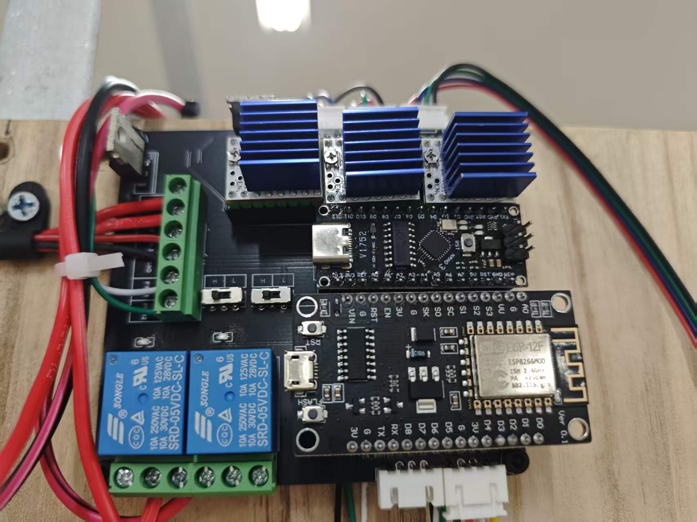
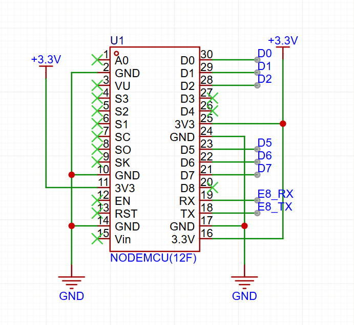
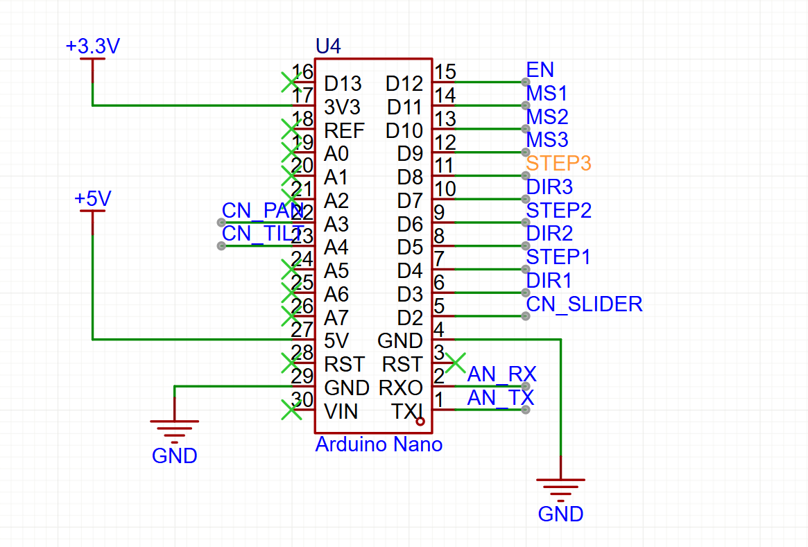
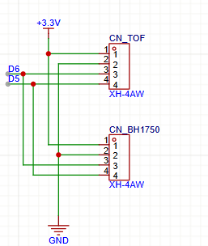
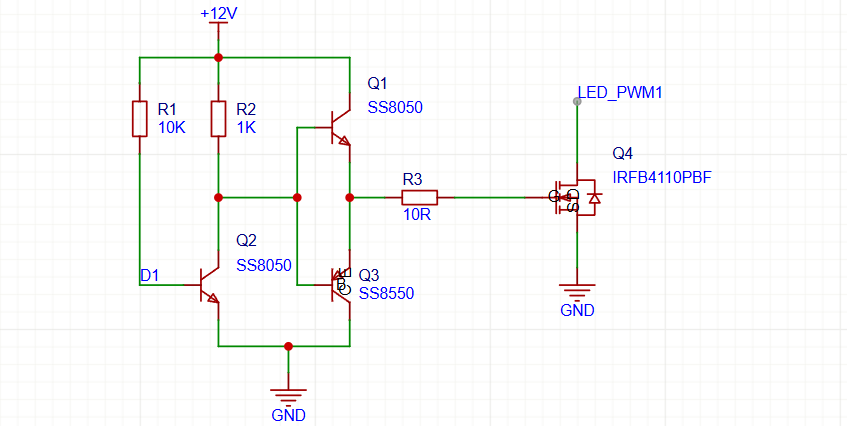
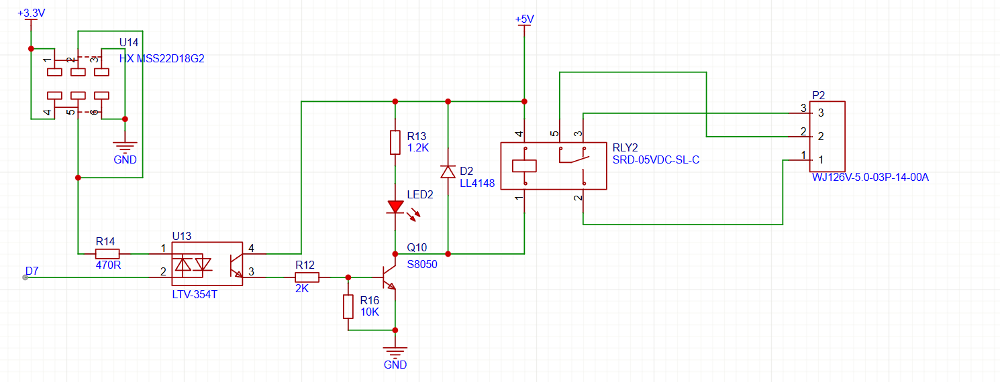
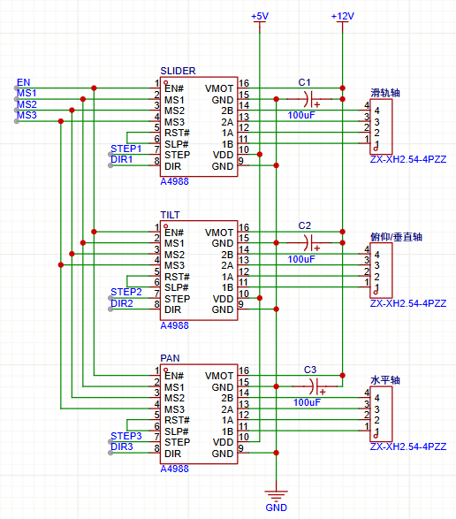
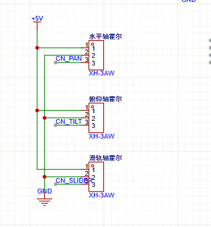

# 灯光集成控制板：双单片机、PWM调光与继电器驱动设计

> Arduino Nano 电机驱动源码：[github.com/NaHSIT/NanoGimbalMotion](https://github.com/NaHSIT/NanoGimbalMotion)  
> ESP8266 源码：[github.com/i-am-genius/8266](https://github.com/i-am-genius/8266)

图1：灯光集成控制板实物。板上可以看到ESP8266核心板、Arduino Nano、三组带散热片的TMC2208电机驱动器、继电器和外部接线端子，实际装配结构与原理图中的功能分区对应。

## 1. 从项目需求进入硬件设计

这个项目需要一个可以主动感知、远程通信并控制灯光和运动机构的灯光节点。节点至少要完成以下任务：

- 通过Wi-Fi接收远程控制指令并上传状态；
- 根据环境光和距离信息调整灯光状态；
- 对冷光、暖光两路LED进行亮度和色温控制；
- 驱动滑轨、水平云台和俯仰云台运动；
- 通过霍尔传感器找到机械零点；
- 控制电雾膜等开关型负载。

如果把ESP8266、Arduino Nano、步进驱动器、继电器模块和MOSFET模块全部用杜邦线连接，功能可以很快跑起来，但供电、信号和接口会越来越混乱。因此我把一个节点需要的两个单片机、传感器接口、串口通信、PWM驱动、继电器驱动和电机驱动接口集中到一块控制板上。

这块板的核心不是“元器件很多”，而是把不同时间尺度、不同电流等级的任务分开：ESP8266处理联网、传感器和灯光，Arduino Nano处理电机脉冲和回零，功率器件负责带载，接插件负责把模块可靠地接出去。

---

## 2. 双单片机架构：为什么要分工

这块控制板使用ESP8266/NodeMCU和Arduino Nano两个单片机。

### 2.1 ESP8266：灯光、传感器和远程通信

ESP8266负责上层节点逻辑，具体包括：

- 通过Wi-Fi与远程系统通信；
- 输出两路PWM，分别调节冷光和暖光；
- 通过两路PWM的占空比组合控制灯光亮度和色温；
- 读取ToF距离传感器和环境光传感器；
- 直接输出继电器控制信号，控制电雾膜等开关负载；
- 接收远程运动指令，再通过TX/RX发送给Arduino Nano。

图1：ESP8266核心板电路。NodeMCU使用`+3.3V`供电，并引出D0、D1、D2、D5、D6、D7、RX和TX等控制信号。

### 2.2 Arduino Nano：电机和霍尔回零

Arduino Nano不参与Wi-Fi、灯光PWM或继电器控制，它专门负责运动执行：

- 解析ESP8266发送的运动指令；
- 输出三组电机的`STEP/DIR`信号；
- 控制滑轨、俯仰轴和水平轴的步进驱动器；
- 读取霍尔传感器；
- 上电寻找零点，并把零点作为后续位置控制的参考。

图2：Arduino Nano核心板电路。D4、D5、D6、D7、D8、D9、D10、D11和D12等引脚用于三组电机的使能、细分、步进和方向控制，A2、A3用于PAN和TILT相关接口，串口引出`AN_RX`和`AN_TX`。

这样分工的原因很简单：ESP8266要处理网络协议、传感器和灯光状态，网络任务的执行时间并不固定；步进电机却需要连续、准确的脉冲。如果让ESP8266同时承担这两件事，网络通信或复杂逻辑可能影响电机脉冲。把电机交给Nano以后，运动时序就独立出来了。

---

## 3. 两个单片机如何通信

ESP8266和Arduino Nano通过TX/RX串口通信。ESP8266是上层控制器，Nano是执行控制器，基本链路如下：

`ESP8266生成目标 → TX/RX发送指令 → Arduino Nano解析 → STEP/DIR驱动电机 → 霍尔传感器反馈状态`。

图3：双主控串口通信电路。ESP8266侧信号命名为`E8_TX`和`E8_RX`，Nano侧命名为`AN_RX`和`AN_TX`，通过P_COMM（PZ254V-12-4P 4针接插件）连接。

ESP8266是`3.3V`逻辑，Arduino Nano是`5V`逻辑，两者串口不能直接短接，需要处理电平兼容问题。电路用 R7（`15kΩ`）和 R8（`33kΩ`）解决这个问题，但两个方向的处理策略不同：

- **AN_TX → E8_RX（Nano发、ESP8266收）**：Arduino Nano 的 TX 输出 5V 高电平，直接接入 ESP8266 的 RX 会超出其 3.3V 容限。R7 串联在这条线上，R8 从该节点接 GND，构成分压网络。高电平时 ESP8266 RX 端电压约为：

  `5V × 33 / (15 + 33) ≈ 3.44V`

  降至 3.3V 附近，保护 ESP8266 的 RX 引脚不被 5V 信号损坏。

- **E8_TX → AN_RX（ESP8266发、Arduino收）**：ESP8266 的 TX 输出 3.3V 高电平。Arduino Nano 的 RX 引脚采用 5V 逻辑，但 3.3V 已超过 Arduino 判断高电平的阈值（通常约 `0.6 × VCC = 3V`），可以被正确识别，因此这一方向无需升压，直接连接即可。

软件上可以把通信内容分成两类：

- ESP8266发送：电机编号、方向、步数、速度、动作类型；
- Nano返回：执行完成、正在运动、回零完成、霍尔触发和异常状态。

Nano不需要理解“为什么要追踪某个目标”，它只需要可靠执行“哪一根轴向哪个方向走多少步”。

---

## 4. I²C传感器接口：ToF和环境光

ToF距离传感器和BH1750环境光传感器都通过I²C连接到ESP8266。两类传感器的功能不同，但通信方式相同，因此可以复用SDA和SCL两根总线：

- ToF用于测量人员或目标与灯节点之间的距离；
- BH1750用于测量环境光照度；
- `+3.3V`给传感器供电；
- SDA、SCL连接ESP8266对应引脚；
- 所有模块共地。

图4：I²C传感器接口电路。CN_TOF和CN_BH1750分别连接ToF和环境光传感器，D5、D6作为I²C信号线，接口同时提供`+3.3V`和GND。

I²C总线需要注意三点：SDA和SCL不能接反；总线上需要合适的上拉电阻；多个模块共用总线时，要避免每个模块的上拉电阻并联后阻值过小。传感器供电和通信地线也必须稳定，否则距离和光照数据会出现异常抖动。

---

## 5. PWM灯光控制：从ESP8266信号到LED功率

PWM是这块控制板最重要的功率控制电路之一。ESP8266输出的PWM只是逻辑信号，不能直接接LED，更不能直接承受LED的工作电流。实际电路分成三层：

1. ESP8266输出PWM控制信号；
2. SS8050/SS8550组成推挽栅极驱动级；
3. IRFB4110PBF作为低边功率MOSFET，控制LED电流。

图5：灯光PWM控制电路。D1是ESP8266输入的PWM信号，Q1、Q2、Q3构成前级驱动，Q4为IRFB4110PBF功率MOSFET，`LED_PWM1`连接LED负载。

### 5.1 为什么需要推挽驱动级

MOSFET的栅极虽然是电压控制端，但栅极存在电容。PWM频率较高、MOSFET栅极电荷较大时，ESP8266 GPIO直接给栅极充放电会遇到两个问题：

- 栅极充放电速度不够，MOSFET长时间处于半导通状态；
- GPIO瞬间输出电流有限，开关边沿变慢，功率损耗增加。

Q1、Q2、Q3组成的前级驱动电路，本质上是一个由小信号三极管构成的推挽/图腾柱驱动级。它的作用不是直接给LED供电，而是快速给Q4的栅极充电和放电：

- PWM有效时，驱动级把较强的栅极电流送入Q4，使Q4快速导通；
- PWM无效时，驱动级把栅极电荷快速抽走，使Q4快速关断；
- 快速切换可以缩短MOSFET处于线性区的时间，降低发热。

R1为`10kΩ`，R2为`1kΩ`，用于设置前级三极管的偏置和电流；R3为`10Ω`，串在Q4栅极前，用于限制栅极瞬间充放电电流、抑制振铃和减小EMI。具体的栅极电阻需要结合PWM频率、MOSFET栅极电荷和波形实测调整。

### 5.2 Q4为什么采用低边开关

Q4的漏极连接`LED_PWM1`，源极接GND，属于低边开关：

`+12V/LED电源 → LED负载 → Q4漏极 → Q4源极 → GND`。

ESP8266只需要改变PWM占空比，就可以改变Q4导通时间。LED的平均电流可以用下面的关系估算：

IAVG ≈ D × ION

其中D为PWM占空比，ION为MOSFET导通时LED的工作电流。两路冷暖LED分别由两路PWM控制：亮度由两路输出的整体功率决定，色温由冷暖两路的相对比例决定。

### 5.3 MOSFET为什么不能只看额定电流

Q4选型时需要同时关注：

- 漏源耐压是否高于LED电源和开关尖峰；
- 连续漏极电流是否满足LED最大电流；
- 在实际栅极驱动电压下的导通电阻RDS(on)；
- 开关频率下的栅极电荷和开关损耗；
- 封装和PCB铜皮能否把热量散出去。

MOSFET导通损耗可以先估算为：

PMOS ≈ ILED2 × RDS(on)

如果PWM频率较高，还要增加开通和关断过程中的动态损耗。功率回路应使用宽铜箔，MOSFET周围留出散热铜皮，并让LED大电流回路远离ESP8266和I²C信号线。

---

## 6. 继电器驱动：ESP8266直接控制，但不能直接带线圈

继电器控制信号来自ESP8266。图中的`D7`是ESP8266输出，经过光耦和三极管后，驱动5V继电器线圈。

图6：继电器驱动电路。控制链路为`D7 → R14 → LTV-354T → R12 → Q10 → SRD-05VDC-SL-C`。

### 6.1 输入侧：D7和光耦LED

ESP8266的D7输出高电平时，电流经过R14进入LTV-354T的输入LED，使光耦导通。R14为`470Ω`，用于限制光耦输入LED电流：

ILED,opt ≈ (VGPIO − VF) / R14

以3.3V GPIO、光耦LED正向压降约1.2V估算：

ILED,opt ≈ (3.3 − 1.2) / 470 ≈ 4.5 mA

这个电流足以驱动光耦输入，同时不会给ESP8266 GPIO造成过大负担。

### 6.2 光耦为什么放在这里

LTV-354T把ESP8266侧和继电器线圈侧用光信号隔开。这样继电器线圈断开时产生的尖峰、负载触点切换时的干扰，不容易直接沿着电源或信号线传回ESP8266。

光耦输出侧由`+5V`供电，输出电流经过R12进入Q10的基极。R12为`2kΩ`，用于限制Q10基极电流；R16为`10kΩ`，用于在光耦关闭时把Q10基极拉低，防止三极管悬空误导通。

### 6.3 Q10为什么用低边驱动继电器

Q10使用S8050，作为继电器线圈的低边开关：

`+5V → SRD-05VDC-SL-C线圈 → Q10集电极 → Q10发射极 → GND`。

当光耦导通时，Q10得到基极电流并饱和导通，继电器线圈通电；当D7关闭时，光耦截止，R16把Q10基极拉低，Q10关断，继电器释放。

### 6.4 D2为什么必须并在线圈两端

继电器线圈是电感性负载，线圈电流不能突变。Q10关断时，如果没有回路，线圈会产生很高的反向感应电压。D2使用LL4148，为线圈断电时提供续流路径，把尖峰电压限制在安全范围内，保护Q10和前级光耦。

LED2和R13组成动作指示：R13为`1.2kΩ`，LED2在继电器驱动时点亮，用于现场快速判断ESP8266控制信号是否已经传到继电器驱动级。

继电器触点侧通过P2接到外部负载。线圈侧是`+5V`低压控制，触点侧可以按照负载需求独立接线，控制信号不会直接承载电雾膜或其他执行器的功率电流。

---

## 7. 三组TMC2208电机驱动

电机驱动电路使用三组TMC2208，分别对应`SLIDER`、`TILT`和`PAN`。Arduino Nano输出使能、细分、步进和方向信号，TMC2208负责把这些逻辑信号转换为步进电机线圈电流。

图7：三组TMC2208电机驱动电路。每组驱动器都有逻辑电源`+5V`、电机电源`+12V`和独立的`100uF`电解电容。

`MS1`和`MS2`决定细分方式，`STEP`决定步数，`DIR`决定方向，`EN`决定驱动器是否输出。TMC2208相比传统驱动器内置了更精细的电流控制，运行噪声更低，同等负载下电机发热也明显改善。逻辑电源和电机电源分开，是为了让TMC2208的控制逻辑与电机功率级分别获得合适的供电。

每个TMC2208旁边配置`100uF`电容，用于吸收电机电流变化带来的电源波动。电机电源线、驱动器地线和电解电容之间的回路应尽量短，避免电机动作时产生的干扰传入ESP8266。

---

## 8. 霍尔传感器回零

三组电机分别配有霍尔传感器接口：水平轴、俯仰轴和滑轨轴。霍尔传感器不负责连续测量位置，而是负责告诉Arduino Nano“机械零点到了”。

图8：三组霍尔传感器接口。每个接口提供`+5V`、GND和独立的霍尔信号。

上电时，Arduino Nano让电机向预定方向运动，持续读取对应霍尔信号；检测到磁铁经过传感器后，停止电机并把当前位置设为零。之后的目标位置都根据零点计算，避免每次上电都依赖上一次断电前保存的位置。

霍尔回零的控制流程是：

1. ESP8266通过TX/RX通知Nano开始初始化；
2. Nano选择对应轴，设置方向并输出STEP脉冲；
3. 霍尔传感器触发，Nano立即停止脉冲；
4. Nano记录零点并向ESP8266返回回零完成状态。

---

## 9. 各模块之间的完整信号链

把整块控制板串起来，可以得到下面的关系：

`远程指令 → ESP8266 → 灯光PWM/继电器/传感器 → TX/RX → Arduino Nano → A4988 → 电机 → 霍尔传感器 → Arduino Nano → TX/RX → ESP8266`。

其中：

- ESP8266负责“决定做什么”；
- Arduino Nano负责“把运动动作做出来”；
- PWM驱动级负责“把逻辑PWM变成功率开关”；
- 继电器驱动级负责“用小电流控制线圈和外部负载”；
- A4988负责“把STEP/DIR变成电机线圈电流”；
- 霍尔传感器负责“给机械系统提供可重复的零点”。

这套分工让不同模块的边界比较清楚：网络忙时不影响电机脉冲，LED大电流不经过ESP8266，继电器线圈尖峰不直接冲击GPIO，传感器数据也不会和电机功率回路混在一起。

从实物图可以直观看到这种分工：上方的散热片区域属于电机驱动功率级，中间和下方是两个控制核心，左侧的蓝色继电器负责开关型负载，绿色端子负责外部电源和执行器接线。把高电流、高发热和低压逻辑分开，是这块板能够稳定工作的基础。

> 这块控制板的设计重点，是把“逻辑控制”和“功率执行”分开：ESP8266负责灯光、传感器、继电器和通信，Arduino Nano负责电机与回零，驱动级负责放大电流，反馈传感器负责确认机械位置。每个模块只承担自己擅长的工作，整块板才容易调试和扩展。
