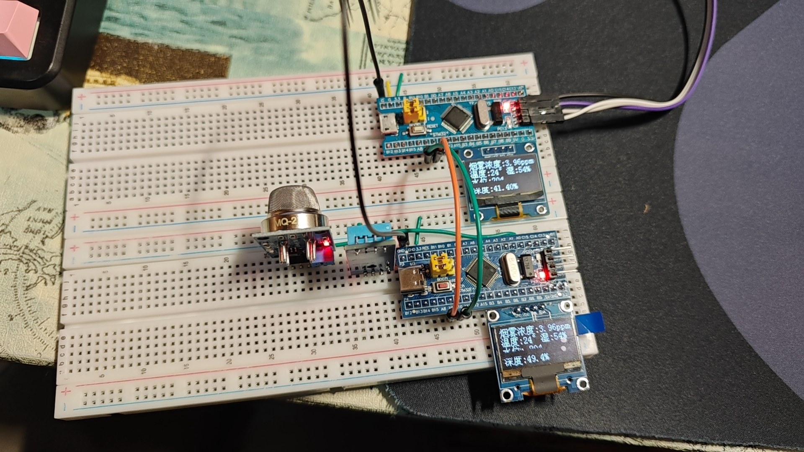
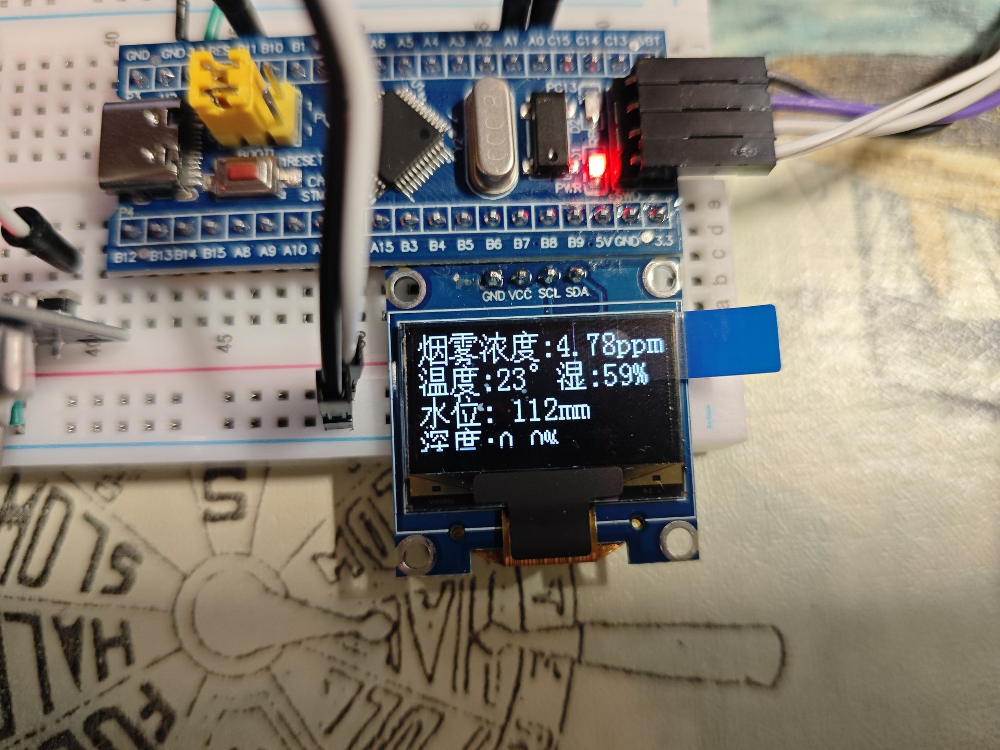
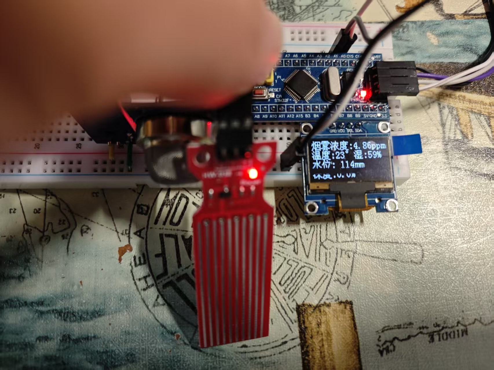
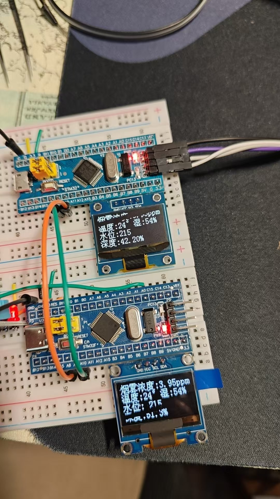
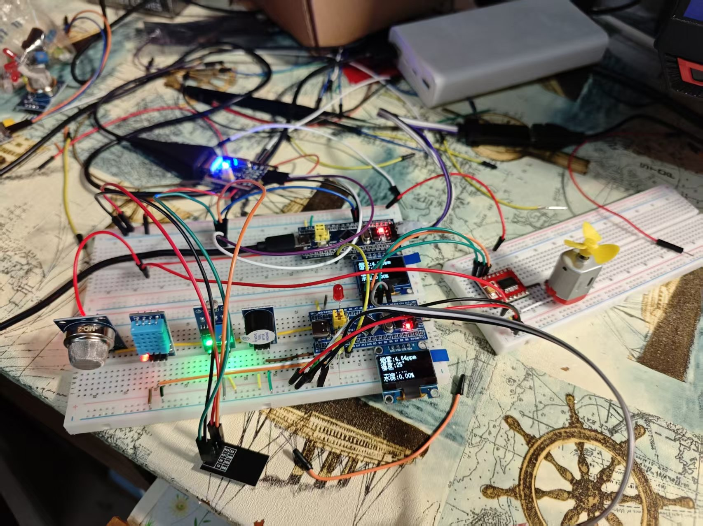
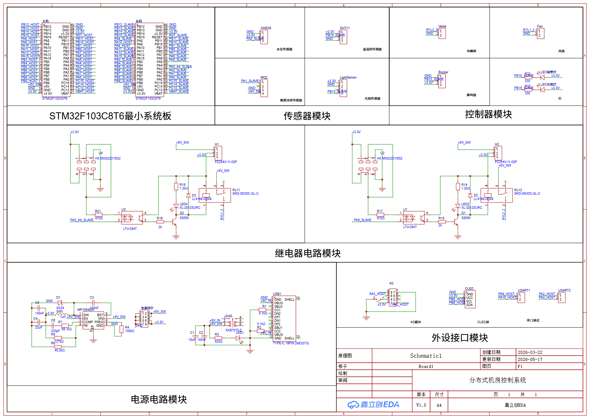
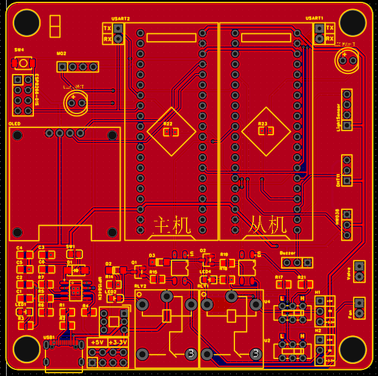
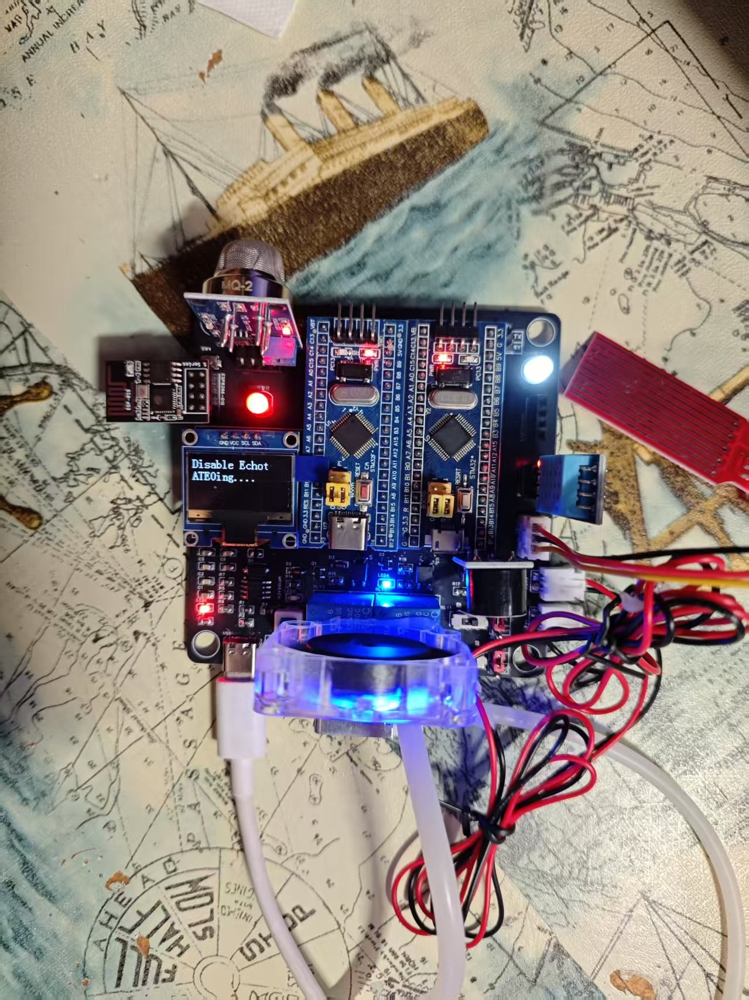

# 从面包板到PCB：STM32主从机房监控、OneNET与ESP32视觉节点

> 源码：[github.com/NaHSIT/computer-room-monitoring-system](https://github.com/NaHSIT/computer-room-monitoring-system)<br>
> App源码：[github.com/NaHSIT/IOT_Application](https://github.com/NaHSIT/IOT_Application)<br>
> 嘉立创EDA工程：[hardware/分布式机房控制系统.eprj](https://github.com/NaHSIT/computer-room-monitoring-system/blob/master/hardware/%E5%88%86%E5%B8%83%E5%BC%8F%E6%9C%BA%E6%88%BF%E6%8E%A7%E5%88%B6%E7%B3%BB%E7%BB%9F.eprj)<br>
> 在线演示：[iot-nahs.netlify.app](https://iot-nahs.netlify.app)

2026年3月，我从两块STM32F103C8T6和面包板开始做这套分布式机房监控系统。最初只是把烟雾、温湿度和水位数据显示到OLED，随后加入主从机串口通信、ESP8266上云、本地自动控制，再把PC网页、Android App和ESP32-S3视觉节点接进来。

这次整理项目，我把此前缺失的硬件过程补全了：从五张面包板测试图，到最终原理图、PCB布局和焊接成品。文章中的阈值、通信格式和任务结构也重新按照当前源码核对，不把照片能说明的“已经搭起来并运行”扩大成未经长期测试的数据。

我还录了两期配套视频：[视频1](https://www.bilibili.com/video/BV14JSUBBESR/)和[视频2](https://www.bilibili.com/video/BV1zwXDBBEmF/)。

---

## 1. 系统结构：采集、汇聚、视觉和应用

系统不是把所有设备都挂在一块单片机上，而是按职责拆成四层：

| 层级 | 硬件或软件 | 当前实现 |
|------|------------|----------|
| 采集与控制 | STM32F103C8T6从机 | 读取DHT11、MQ2、HW038和光敏传感器，驱动风扇、电磁阀、LED与蜂鸣器 |
| 数据汇聚 | STM32F103C8T6主机、ESP8266 | 通过USART接收从机数据，在OLED显示，并通过MQTT接入OneNET |
| 视觉节点 | ESP32-S3、OV2640、ST7789 | 采集画面、LCD预览、抽帧上传YOLO服务，再上报人数结果 |
| 应用端 | PC网页、Android App | 读取OneNET数据、显示趋势、下发控制指令和导出CSV |

主机与从机通过USART1连接。从机负责离传感器和执行器最近的部分，主机负责汇总数据和上云。这样即使云端暂时不可用，从机当前源码里的自动判断仍然可以继续执行。

这里需要说明一个实际差异：当前STM32主机固件通过USART2驱动ESP8266，并使用AT指令接入网络；最终原理图里另外保留了一个标为“4G模块”的接口。它们分别代表当前固件方案和硬件扩展接口，不能写成已经完成了4G联网。

---

## 2. 硬件是怎样从面包板走到PCB的

### 2.1 先在面包板上拆开验证

第一阶段使用两块STM32最小系统板、两块OLED和传感器模块搭建主从节点。面包板的意义不是好看，而是可以随时换线、单独断开一个模块，先确认采集、显示和串口链路。



下面这张近照记录了较早的显示版本。OLED上同时出现烟雾、温度、湿度、水位和深度；从机源码的更新日志也写明，后续把“水位”和“深度”合并成水深百分比显示。因此这不是最终界面，而是功能逐步合并前留下的测试状态。



水位模块接入时，我把探头单独拉到面包板外，便于观察输入变化时OLED读数。照片只记录了当时的接线和显示结果，没有据此给出传感器精度或长期稳定性结论。



主从通信接通后，两块STM32和两块OLED可以放在同一块面包板上对照。当前固件由从机每2秒发送一帧数据，主机收到并解析成功后更新自己的OLED。



最后一张面包板图把传感器和执行器一起接入：能看到MQ2、DHT11、水位探头、OLED、继电器、蜂鸣器和小风扇。此时接线已经明显变密，继续靠杜邦线维护很容易插错位置，也正是转向原理图和PCB的节点。



### 2.2 最终原理图：把模块关系固定下来

最终原理图按功能划分为STM32最小系统板、传感器、控制器、继电器、电源和外设接口几个区域。



从图中可以直接确认这些连接：

- 两块STM32F103C8T6最小系统板分别作为主机和从机；
- 传感器接口包括HW038、DHT11、MQ2和光敏模块；
- 控制器接口包括电磁阀、风扇、蜂鸣器和两路LED；
- 两路继电器都使用LTV-354T光耦、S8050三极管、续流二极管和SRD-05VDC-SL-C继电器；
- 电源区包含USB-C输入、MP1584EN降压、电源开关，以及5V和3.3V接口；
- 外设区保留OLED、串口调试和联网模块接口。

这张图能说明电路连接，但不能替代制造前的封装、网络名和电气规则检查。

### 2.3 PCB布局与焊接成品

PCB把两块STM32放在上半区，传感器和外设接口分布在四周，电源与继电器驱动集中在下半区。四角预留安装孔，主机、从机的丝印也直接标在对应位置。



焊接成品与前面的原理图和布局图能够对应：板上安装了两块STM32、OLED、MQ2、DHT11、继电器和接口模块，并接入水位探头与风扇进行通电测试。照片中的指示灯和OLED已经点亮，但这只能证明当时的上电与运行状态，不能替代连续运行、温升和抗干扰测试。



完整嘉立创工程已经放进项目仓库的[`hardware/分布式机房控制系统.eprj`](https://github.com/NaHSIT/computer-room-monitoring-system/blob/master/hardware/%E5%88%86%E5%B8%83%E5%BC%8F%E6%9C%BA%E6%88%BF%E6%8E%A7%E5%88%B6%E7%B3%BB%E7%BB%9F.eprj)，其中包含对应的原理图和PCB，可用于核对与二次修改。

---

## 3. STM32从机：采集、判断和执行

从机主循环每2秒完成一次采集、控制、显示和上报。当前源码采集四类环境量：

- DHT11读取温度与湿度；
- MQ2经ADC采样并换算烟雾浓度；
- HW038经ADC采样并换算水深百分比；
- 光敏模块提供明暗状态。

执行端包括风扇、电磁阀、两路LED和蜂鸣器。自动逻辑直接运行在从机，不需要先等OneNET返回结果。

### 3.1 以代码为准的控制条件

重新核对`Assess.c`后，当前实际执行条件如下：

| 条件 | 动作 |
|------|------|
| `50≤烟雾<100ppm` | LED1以50ms亮、50ms灭的节奏闪烁 |
| `100≤烟雾<150ppm` | LED1以5ms亮、5ms灭的节奏闪烁 |
| `烟雾≥200ppm` | LED1常亮 |
| `温度>27℃`、`烟雾≥20ppm`或`湿度≥95%` | 风扇开启 |
| 水深连续3次大于74% | 蜂鸣器开启 |
| 水深大于75% | 电磁阀开启 |
| 水深等于0 | 电磁阀关闭 |
| 光敏模块判断环境过暗 | LED2开启 |

源码目前在`150≤烟雾<200ppm`区间没有对应分支，会落入`else`并关闭LED1；部分注释对风扇烟雾阈值写的是50ppm，而实际判断使用20ppm。这两处是当前版本真实存在的不一致，后续应统一条件和注释，而不是在文章里把它们写成已经完善的分级报警。

### 3.2 手动控制不会永久覆盖自动模式

主机下发的控制帧格式为：

```text
CTRL:LED1=?,LED2=?,BUZZER=?,FAN=?,VALVE=?
```

从机收到后进入手动模式，直接设置五个执行器，并把计时器清零。主循环每2秒累加一次计数，达到15次后退出手动模式，因此当前实现的回退时间约为30秒。

这个机制解决的是“远程命令刚执行就被本地自动判断覆盖”的冲突。不过它没有为每个执行器单独记录控制权，当前是整组设备一起进入手动模式。

---

## 4. 主从串口与OneNET链路

从机发送的是带帧头、帧尾的文本数据：

```text
@SMOKE=...,TEMP=...,HUMI=...,DEEP=...,FAN=...,LED1=...,LED2=...,BUZZER=...,VALVE=...,MODE=...\r\n
```

主机用`sscanf`一次解析10个字段，成功后更新OLED，再调用三个发布函数把传感器、LED与蜂鸣器状态、风扇与电磁阀状态分组上报OneNET。当前代码在前两组发布后各延时200ms，不是此前文章里写的一秒。

下行消息由ESP8266串口中的`+MQTTSUBRECV`标记触发解析，主机再把控制帧转发给从机。这个方案直观、方便串口调试，但数据帧目前没有长度字段、校验和或重传机制，干扰环境下的完整性保护还比较弱。

---

## 5. ESP32-S3视觉节点

环境传感器看不到现场人数，所以项目里还有一条独立的视觉链路。当前ESP32工程使用OV2640采集RGB565画面，并把画面送到ST7789 LCD显示。

程序由一个图像采集主循环和一个FreeRTOS上传任务组成，两者通过互斥锁传递JPEG缓冲区。主循环每60帧抽取一帧，用`fmt2jpg`按质量80进行软件编码；如果上传任务正在占用锁，本次图片会被释放，不阻塞后续画面采集。当前代码使用`xTaskCreate`创建上传任务，没有把两个任务固定到指定CPU核心，因此不能把它描述成已经实现了明确的双核分工。

上传任务通过HTTP把JPEG发送到YOLO服务，读取响应中的人数和最高置信度，再用MQTT把人数属性上报OneNET。项目仓库包含ESP32端的请求与解析代码，但没有包含YOLO服务端实现，所以这里不进一步声称具体模型版本、服务器硬件或部署平台。

---

## 6. 网页与Android App

PC端是纯静态HTML和原生JS应用，使用Tailwind CSS完成界面、Chart.js绘制图表，并直接请求OneNET API。除登录页外，当前项目有六个主要功能页面：仪表盘、监测、控制、历史、报警和设置。

设置页允许配置OneNET产品、设备和Token，也可以维护传感器与控制器的数据模型。每个项目通过`cloudKey`绑定物模型标识符，仪表盘和图表再按配置动态生成。历史页可以把浏览器中保存的数据导出为带UTF-8 BOM的CSV。

Android App使用Kotlin封装WebView，加载`android_asset/www/login.html`。CSV导出通过`JavascriptInterface`进入原生层，再使用`FileProvider`和`Intent.ACTION_SEND`调出系统分享界面。这样Web界面能够复用，但核心数据和配置仍主要存放在WebView的`localStorage`中。

这种架构适合个人项目和受控环境，不等于生产级安全方案。前端Token会进入浏览器，STM32和ESP32源码中也存在硬编码的开发网络参数与OneNET鉴权信息；公开仓库中的这些凭据应当更换，实际部署还需要HTTPS或加密MQTT、最小权限和服务端代理。

---

## 7. 当前能确认的结果与仍需补的测试

从现有代码、工程文件和照片，可以确认：

- STM32主从固件、ESP32视觉节点和PC/Android应用均有对应源码；
- 面包板阶段完成了传感器接入、OLED显示和主从节点联调；
- 最终原理图、PCB布局、嘉立创工程文件和焊接成品能够相互对应；
- 成品板有实际通电、显示和外设接线照片。

现有材料还不能证明长期无人值守运行、传感器精度、网络抗干扰能力和真实机房部署效果。MQ2初始化代码也在启动时立即执行校准，而源码注释建议预热5分钟后再校准，这部分需要用新的测试流程补齐。

项目源码和硬件工程都已经整理到[computer-room-monitoring-system](https://github.com/NaHSIT/computer-room-monitoring-system)。如果要复现，应先替换网络与OneNET配置，再分别编译主机、从机和ESP32工程；硬件下单前也应重新执行ERC、DRC和封装核对。

> 从面包板到原理图、PCB再到焊接成品，这个项目已经把硬件链路完整走了一遍；真实机房里的长期稳定性、传感器校准和安全加固，则要继续用测试结果回答。
